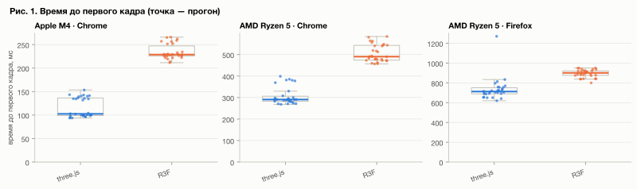
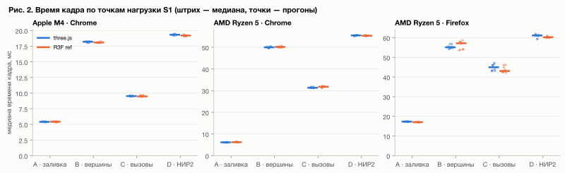
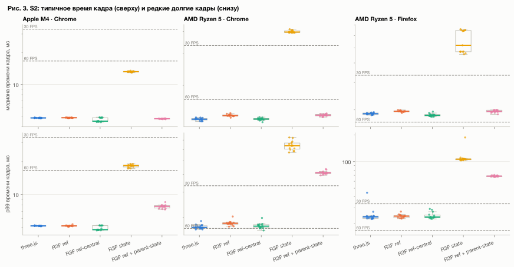
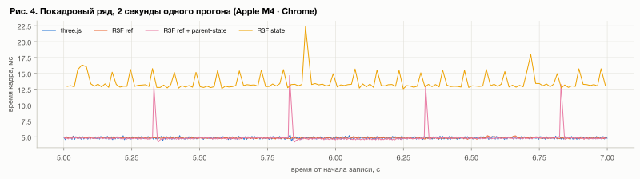
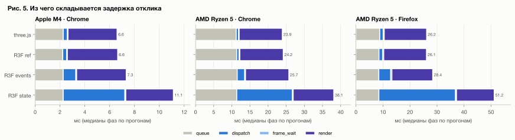
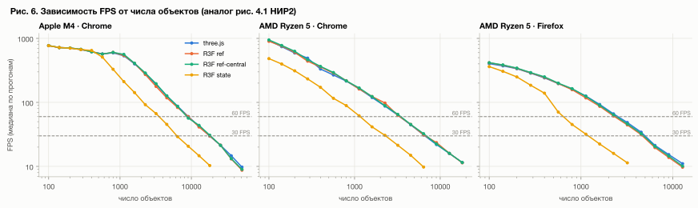
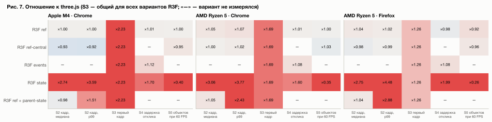

# Рисунки

## Рис. 1. Время до первого кадра (S3)

Холодная загрузка сцены из 100 статичных объектов, 30 загрузок на реализацию. Точка — прогон, ящик — межквартильный размах. R3F стартует в 1,3–2,2 раза медленнее на всех платформах.

[SVG](assets/figures/01_s3_ttfr.svg) · [PNG](assets/figures/01_s3_ttfr.png)

## Рис. 2. Время кадра по точкам нагрузки S1

Свип по характеру нагрузки: A — заливка, B — вершины, C — число вызовов отрисовки, D — исходная сцена НИР2. Штрих — медиана, точки — прогоны. Во всех точках, где хватает точности, R3F ref и three.js равны в пределах ±5%.

[SVG](assets/figures/02_s1_frame.svg) · [PNG](assets/figures/02_s1_frame.png)

## Рис. 3. S2: типичное время кадра и редкие долгие кадры

3000 анимируемых объектов. Сверху — медиана времени кадра, снизу — p99; логарифмическая шкала, пунктир — бюджеты 60 и 30 FPS. Вариант state (setState каждый кадр) в 2,7–3 раза медленнее, parent-state даёт хвост p99.

[SVG](assets/figures/03_s2_frame.svg) · [PNG](assets/figures/03_s2_frame.png)

## Рис. 4. Покадровый ряд, 2 секунды одного прогона (Apple M4 · Chrome)

Пики у parent-state повторяются каждые 0,5 с — при каждом изменении state над Canvas React перерисовывает всё дерево сцены.

[SVG](assets/figures/03_s2_timeseries.svg) · [PNG](assets/figures/03_s2_timeseries.png)

## Рис. 5. Задержка отклика на клик по фазам (S4)

Медианы фаз queue → dispatch → frame_wait → render; их сумма равна задержке от события до конца отрисовки кадра с подсветкой. setState на клик удлиняет обработчик (dispatch) в 15–25 раз.

[SVG](assets/figures/04_s4_phases.svg) · [PNG](assets/figures/04_s4_phases.png)

## Рис. 6. Зависимость FPS от числа объектов (S5)

Свип N по сетке ×√2 от 100 до 51 200 объектов, обе оси логарифмические. Кривые three.js, R3F ref и ref-central почти совпадают; state выходит за бюджет при в 2,5–4 раза меньшем числе объектов.

[SVG](assets/figures/05_s5_fps.svg) · [PNG](assets/figures/05_s5_fps.png)

## Рис. 7. Сводка: во сколько раз вариант R3F отличается от three.js

Отношение медиан по сценариям и платформам. Синий — лучше three.js, красный — хуже (насыщение на ×2); цвет показывает величину, а не значимость.

[SVG](assets/figures/07_summary.svg) · [PNG](assets/figures/07_summary.png)
