# Отчёт: публикация результатов исследования статическим сайтом с деплоем на GitHub Pages и Helios ИТМО

**Автор:** Лев Алексеев (s505996) · **Дата:** 22.09.2026
**Генератор:** MkDocs 1.6.1 + Material for MkDocs 9.7.7 · **Python:** 3.13

## Ссылки

| Что | Адрес |
|---|---|
| Репозиторий сайта | https://github.com/LEVALEXEEV/nir-site |
| Репозиторий данных (подмодуль: стенд и сырые результаты) | https://github.com/LEVALEXEEV/benchmark (ветка `nir3-protocol`, коммит `710cbf7`) |
| Сайт на GitHub Pages | https://levalexeev.github.io/nir-site/ |
| Сайт на Helios ИТМО | https://se.ifmo.ru/~s505996/nir/ |
| Превью веток на Helios | `https://se.ifmo.ru/~s505996/nir/preview/<ветка>/` |
| Запуски CI | https://github.com/LEVALEXEEV/nir-site/actions |

Сайт показывает результаты НИР «three.js vs react-three-fiber»: 7 рисунков и
14 таблиц с подписями, полный отчёт анализа, методику с формулами и
происхождение данных. Рисунки и таблицы в репозитории сайта **не хранятся**:
при каждой сборке CI заново исполняет ноутбук анализа на сырых данных
зафиксированного коммита `benchmark`.

---

## 1. Ход работы

| № | Шаг задания | Что сделано | Результат / проверка |
|---|---|---|---|
| 1 | Python, pip, virtualenv | Python 3.13.7 (Homebrew), `pip3 --version` → pip 25.2 | `python3 -m pip install virtualenv` отказано по PEP 668 (Python из Homebrew «externally managed») |
| 2 | Установить virtualenv | `brew install virtualenv` — способ из документации virtualenv для macOS | `virtualenv --version` → 21.9.0 |
| 3 | Каталог и окружение | `NIR/nir-site`, `virtualenv -p python3.13 .venv`, `source .venv/bin/activate` | окружение изолировано от системного Python |
| 4 | Зависимости, .gitignore | `requirements.in` — прямые зависимости; `requirements.txt` — полный lock (`pip freeze`, 130 пакетов с точными версиями; `appnope` — с маркером `sys_platform == "darwin"`). `.gitignore`: `.venv/`, `site/`, `site-*/`, `_build/`, `_work/`, `docs/results/`, кэши | CI ставит ровно тот же набор |
| 5 | MkDocs и каркас | тема Material, язык `ru`, светлая/тёмная тема, `font: false` (без Google Fonts), шаблон `overrides/main.html` с меткой сборки, KaTeX 0.18.7 в `docs/assets/katex` (скрипт `vendor_katex.sh` проверяет sha512 архива) | — |
| — | Генерация данных | `make content` → `scripts/build_content.py`: исполнение `nir3_analysis.ipynb` в копии `_work/`, страницы «Отчёт анализа», «Рисунки», «Таблицы», «Происхождение данных»; подписи — `content/captions.yml`; артефакт без подписи — ошибка сборки | 14 из 14 таблиц совпали с закоммиченными побайтно |
| 6 | Локальная сборка | `make serve` (предпросмотр), `make site` = `mkdocs build --strict` + `scripts/check_site.py` (ссылки от корня домена, внешние ресурсы). `strict: true` и `validation.anchors: warn` заданы в `mkdocs.yml` | сборка 0,2–1 с после генерации контента |
| 7 | Git и GitHub | `git init -b main`, подмодуль `benchmark`, `gh repo create LEVALEXEEV/nir-site --public`, `git push` | репозиторий публичный |
| 8 | GitHub Actions, Pages | Pages → Source = GitHub Actions (`gh api -X POST repos/…/pages -f build_type=workflow`). Workflow `site.yml`: `build` → `pages` + `helios` параллельно. Разница двух способов публикации — в таблице 1.1 | первый же запуск зелёный |
| 9 | Helios | учётная запись `s505996`; отдельный deploy-ключ ed25519 добавлен в `~/.ssh/authorized_keys` (пароль использован один раз, в CI не хранится); секрет `HELIOS_SSH_KEY`; ключ хоста закреплён в `scripts/helios/known_hosts` | `https://se.ifmo.ru/~s505996/` отдаёт `~/public_html`; сайт — в подкаталоге `nir/`, существующие файлы не тронуты |
| 10 | Workflow под площадку | job `helios`: rsync → атомарное переключение → healthcheck → автооткат; `helios-ops.yml`: ручной откат, список релизов, удаление превью | см. раздел 4 |
| 11 | Базовый URL | `site_url: !ENV [SITE_URL, …]`: Pages — `https://levalexeev.github.io/nir-site/`, Helios — `https://se.ifmo.ru/~s505996/nir/`, превью — `…/nir/preview/<ветка>/`; поэтому в CI две сборки из одного контента. `use_directory_urls: true`. Ссылки внутри страниц относительные; `check_site.py` запрещает `href="/…"` | ошибка «работает на Pages, ломается в подкаталоге» поймана и исправлена (раздел 6, ошибка 1) |
| 12 | Проверка не только визуально | `scripts/healthcheck.sh`: код 200, контрольная строка `<meta name="nir-build" content="<sha>">`, индекс поиска, KaTeX и шрифт с самого сайта, сжатие JS, 404 от сайта. Отдельно — Chromium (Playwright) с **заблокированными запросами ко всем внешним хостам** | таблица 1.2 |
| 13 | Лицензии | `LICENSE` — MIT (код), `LICENSE-CONTENT` — CC BY 4.0 (тексты, рисунки, таблицы), KaTeX — MIT | страница «Лицензии» на сайте |
| 14 | Отладка | — | раздел 6 |

### 1.1. Два способа публикации на GitHub Pages

| | push в ветку `gh-pages` (`peaceiris/actions-gh-pages`) | `actions/upload-pages-artifact` + `actions/deploy-pages` (выбран) |
|---|---|---|
| Что публикуется | коммит собранного сайта в отдельную ветку; Pages раздаёт ветку | tar-архив — артефакт запуска; Pages раздаёт конкретный деплой |
| Права workflow | `contents: write` (пишет в репозиторий) | `pages: write` + `id-token: write` (OIDC); репозиторий только на чтение |
| Настройка Pages | Source = Deploy from a branch | Source = GitHub Actions |
| История и откат | история сайта в git, откат `git revert`; репозиторий растёт от сгенерированных файлов | в git ничего; откат — повторный запуск старого workflow, пока жив артефакт (по умолчанию 1 день), иначе revert и сборка |
| Защита | нет окружения | окружение `github-pages`: деплой только с разрешённых веток |

### 1.2. Проверки опубликованного сайта

| Проверка | GitHub Pages | Helios |
|---|---|---|
| Главная: HTTP 200 и метка сборки `nir-build = <sha коммита>` | ✓ | ✓ |
| Рисунки / таблицы / методика: 200 и контрольные строки «Рис. 1.», «Таблица 13.», `class="arithmatex"` | ✓ | ✓ |
| `search/search_index.json` — 200, содержит «three.js» | ✓ | ✓ |
| `assets/katex/katex.min.js` и `KaTeX_Main-Regular.woff2` с самого сайта | ✓ | ✓ |
| Главный бандл JS приходит с `Content-Encoding: gzip` | ✓ | ✓ (после исправления, ошибка 8) |
| Несуществующий путь → 404 со страницей сайта | ✓ | ✓ (через `.htaccess`, ошибка 2) |
| Формулы при недоступных CDN (Chromium, все внешние хосты заблокированы): на странице «Методика» | 19 формул, ошибок KaTeX 0 | 19 формул, ошибок KaTeX 0 |
| Поиск (русский стеммер): «задержка» / «бутстрап» / «ёмкость» / «гипотеза» / «three» | 5 / 3 / 4 / 3 / 6 результатов | 5 / 3 / 4 / 3 / 6 результатов |
| Внешние запросы со страниц | только `api.github.com` (виджет «звёзды репозитория», без него сайт работает) | то же |

Ограничение поиска lunr: «емкость» (через «е») не находит «ёмкость».

---

## 2. Измерения

### 2.1. Время сборки в CI (job `build`, ubuntu-24.04, кэш pip включён)

| Запуск | Ветка | Checkout с подмодулем, с | Зависимости, с | Исполнение ноутбука (шаг), с | из них ноутбук, с | `mkdocs build --strict` + проверка (Pages / Helios), с | Job `build`, с |
|---|---|---|---|---|---|---|---|
| [#1](https://github.com/LEVALEXEEV/nir-site/actions/runs/35726378491) | main | 7 | 43 | 16 | 13,6 | 1 / 1 | 78 |
| [#2](https://github.com/LEVALEXEEV/nir-site/actions/runs/35726634226) | demo/auto-rollback | 5 | 38 | 22 | 18,4 | — / 1 | 71 |
| [#3](https://github.com/LEVALEXEEV/nir-site/actions/runs/35726851267) | demo/auto-rollback | 5 | 38 | 22 | — | — / 1 | 76 |
| [#4](https://github.com/LEVALEXEEV/nir-site/actions/runs/35728187550) | main | 8 | 39 | 20 | 16,5 | 1 / 0 | 83 |
| [#5](https://github.com/LEVALEXEEV/nir-site/actions/runs/35728276425) | demo/auto-rollback | 5 | 39 | 23 | 19,3 | — / 1 | 76 |
| [#6](https://github.com/LEVALEXEEV/nir-site/actions/runs/35729544735) | main | 5 | 39 | 22 | 19,1 | 1 / 1 | 83 |
| [#7](https://github.com/LEVALEXEEV/nir-site/actions/runs/35732037105) | main | 4 | 37 | 23 | 18,9 | 1 / 1 | 82 |
| **Медиана** | | **5** | **39** | **22** | **18,7** | **1 / 1** | **78** |
| Локально (Apple M4) | — | — | — | 30 (первый запуск) / 6,5 | 6,5 | 0,2 | — |

Половина времени сборки — установка зависимостей (130 пакетов анализа; для
одного MkDocs хватило бы ~20). Исполнение ноутбука — 16–23 с.

### 2.2. Время развёртывания

**Push → опубликовано и проверено** (от создания запуска до завершения job):

| Запуск | Ветка | Сборка, с | Pages: `deploy-pages`, с | Pages: healthcheck, с | Pages: job, с | Helios: rsync + переключение, с | Helios: healthcheck, с | Helios: job, с | Весь запуск, с |
|---|---|---|---|---|---|---|---|---|---|
| #1 | main | 78 | 5 | 1 | 10 | 14 | 13 | 35 | 124 |
| #2 | demo (превью) | 71 | — | — | — | 9 | 8 | 21 | 103 |
| #4 | main | 83 | 8 | 1 | 13 | 7 | 9 | 21 | 114 |
| #6 | main | 83 | 15 | 2 | 22 | 10 | 12 | 32 | 137 |
| #7 | main | 82 | 13 | 1 | 22 | 12 | 16 | 36 | 130 |
| **Медиана (main: #1, #4, #6, #7)** | | **82,5** | **10,5** | **1** | **17,5** | **11** | **12,5** | **33,5** | **127** |

**Выкладка на Helios с машины автора (Россия → helios.cs.ifmo.ru:2222):**

| Операция | Время |
|---|---|
| Первый деплой (связывать не с чем, 120 файлов, 6,2 МБ) | 3 с |
| Повторные деплои `main` | 2 с, 2 с, 1 с, 2 с |
| Первый деплой превью ветки | 3 с |
| Откат (`deploy.sh rollback main`) | 0,45 с |
| Ручной откат через workflow `helios-ops` (с healthcheck) | job 21 с, запуск 32 с |
| Удаление превью при удалении ветки (`helios-ops`, событие `delete`) | запуск 17 с |

**Обнаружение сломанной выкладки и автооткат** (демо: в `.htaccess` дописан `Require all denied`):

| | До исправления (запуск #3) | После исправления (запуск #5) |
|---|---|---|
| Healthcheck | 599 с, отменён таймаутом job | 44 с, `failure` |
| Автооткат | не выполнен (job `cancelled`) | 2 с, выполнен |
| Время, пока посетители видели сломанную версию | ≈ 11 мин + до ручного отката | ≈ 46 с |

### 2.3. Вес страниц

**Сборка на диске:**

| Что | Размер |
|---|---|
| Сайт целиком (`site/`) | 6,2 МБ, 119 файлов |
| Ассеты темы (`assets/javascripts`) | 2,3 МБ, из них 956 КБ — языковые модули lunr (браузер грузит только `ru`, `multi`, `stemmer.support`) |
| KaTeX (JS, CSS, 20 шрифтов woff2) | 600 КБ |
| Рисунки: 7 SVG / 7 PNG / 7 PNG в отчёте анализа | 928 КБ / 988 КБ / 484 КБ |
| Индекс поиска `search_index.json` | 248 КБ |
| Артефакт `github-pages` / `site-helios` в CI | 2,63 МБ / 2,66 МБ (сжатые архивы) |

**Загрузка страниц браузером** (Chromium, холодный кэш, медиана 3 загрузок;
«передано» — байты по сети с учётом сжатия; клиент — машина автора в России):

| Страница | Размер HTML (сжатый), КБ | Запросов | Pages: передано, КБ | Helios до исправления сжатия, КБ | Helios после, КБ | Pages: TTFB / load, мс | Helios: TTFB / load, мс |
|---|---|---|---|---|---|---|---|
| `/` (главная) | 6,9 / 8,2 | 11 | 191 | 489 | 217 | 42 / 313 | 36 / 244 |
| `/results/report/` | 16,8 / 20,6 | 19 | 733 | 1034 | 762 | 50 / 420 | 36 / 373 |
| `/results/figures/` | 7,6 / 9,0 | 17 | 339 | 1311 | 359 | 46 / 338 | 36 / 275 |
| `/results/tables/` | 11,6 / 14,3 | 10 | 196 | 495 | 223 | 44 / 324 | 37 / 275 |
| `/method/` (формулы) | 7,3 / 8,8 | 14 | 245 | 543 | 270 | 47 / 371 | 40 / 314 |
| `/about/report/` | 14,2 / 17,1 | 10 | 199 | 498 | 226 | 50 / 358 | 36 / 244 |

(в колонке HTML — Pages / Helios: Pages сжимает HTML сильнее). Исправление
сжатия на Helios (ошибка 8) уменьшило вес страниц в 1,4–3,7 раза; остаток
разницы с Pages — более слабое сжатие HTML/CSS на стороне nginx Helios.

### 2.4. Обрыв развёртывания на середине

| Параметр | Значение |
|---|---|
| Способ | `RSYNC_EXTRA=--bwlimit=5 deploy.sh upload …`, процесс убит через 8 с |
| Загружено в `.incoming-<id>` | 88 файлов из 120 |
| Код ответа сайта во время и после обрыва | 200 |
| Отдаваемая версия | прежняя (`nir-build = dddfede…`), healthcheck старой версии — OK |
| Следующий деплой | «удаляю недокачанный релиз .incoming-20260922T121120Z-0000000», публикация за 2 с |

---

## 3. Исследовательское задание: анализ конвейера «эксперимент → артефакт → страница»

Полная версия — на сайте: https://levalexeev.github.io/nir-site/about/pipeline/

### 3.1. Способы доставки результата на страницу

| Способ | Как работает | Плюсы | Минусы | Когда подходит |
|---|---|---|---|---|
| Статические изображения, сохранённые вручную (базовый) | автор строит рисунок локально и коммитит PNG | проще всего; сборка мгновенная | нет связи рисунка с кодом и данными; таблицы переписываются руками; бинарные файлы в истории git | схемы, скриншоты — то, что не вычисляется |
| nbconvert | `jupyter nbconvert --execute` / `ExecutePreprocessor`; вывод в Markdown/HTML | работает с любым генератором | кэша нет | небольшие ноутбуки, как здесь |
| MyST-NB (Sphinx, Jupyter Book) | исполнение при сборке; `nb_execution_mode`: off / force / auto / cache / inline | `cache` через jupyter-cache перезапускает только изменённые ноутбуки | кэш зависит от **кода** ноутбука, а не от **данных**: новые данные при старом коде → устаревший результат | книги и документация на Sphinx |
| Quarto | `quarto render` исполняет `.qmd`/`.ipynb`; `execute: freeze: auto` хранит результаты в `_freeze/` (коммитится) | CI не пересчитывает, пока не изменён исходник | та же проблема «заморожен код, а не данные»; свой генератор сайта | статьи, отчёты, сайты с R/Python |
| papermill | подставляет параметры в ячейку с тегом `parameters`, сохраняет исполненную копию | один шаблон — много отчётов (сценарий × устройство × браузер); исполненный ноутбук — протокол запуска; ложится на `strategy.matrix` | не публикует сам — нужен nbconvert/MyST-NB; отладка «почему этот запуск другой» | однотипные отчёты по срезам данных |
| Скрипт генерирует Markdown и CSV, вызов из Makefile / nox | генератор сайта о вычислениях не знает; интерфейс — файлы | шаги кэшируются и проверяются независимо; работает с любым генератором | прозу анализа надо держать синхронной с числами вручную | большие конвейеры |

**Выбрано в работе:** гибрид nbconvert + скрипт. `scripts/build_content.py`
исполняет ноутбук и публикует его целиком без кода (текст и числа из одного
запуска), а рисунки и таблицы раскладывает в галереи с подписями из
`captions.yml`. Для детерминизма SVG задаются `SOURCE_DATE_EPOCH` и
`svg.hashsalt` — иначе рисунок менялся бы при каждой сборке, и хеш был бы бесполезен.

### 3.2. Ограничения CI для тяжёлых вычислений (GitHub Actions, сентябрь 2026)

| Ограничение | Значение | Что это значит для вычислений |
|---|---|---|
| Время job на GitHub-hosted runner | 6 ч | длинные расчёты делятся на части с промежуточными артефактами |
| Время workflow | 35 дней | на практике не ограничивает |
| Минуты | публичный репозиторий — бесплатно; приватный на Free — 2000 мин/мес, macOS ≈ в 10 раз дороже Linux | часовой пересчёт на каждый push в приватном репозитории исчерпает лимит за неделю |
| Ресурсы стандартного runner (Linux) | публичный: 4 CPU / 16 ГБ RAM / 14 ГБ SSD; приватный: 2 CPU / 8 ГБ | датасет > ~10 ГБ не поместится на диск, модель > 16 ГБ — в память |
| GPU | нет на стандартных runner; GPU-runner — только платные larger runners на Team / Enterprise | всё, что требует CUDA, в бесплатном CI не выполняется |
| Кэш | 10 ГБ на репозиторий; удаляется через 7 дней без обращений; при переполнении вытесняются старые; ветка видит кэш только свой и основной ветки | кэш — ускоритель, а не хранилище результатов |
| Артефакты | 500 МБ хранилища на Free для приватных; хранение по умолчанию 90 дней | промежуточные данные ограничены объёмом и сроком |
| Параллельность | 20 job одновременно на Free; матрица ≤ 256 job | массового распараллеливания нет |
| GitHub Pages | сайт ≤ 1 ГБ, деплой ≤ 10 мин, мягкий лимит трафика 100 ГБ/мес | на сайт идут сводки, а не сырые данные |
| Среда | чужое железо, нет GPU с дисплеем, шумные соседи | **замеры производительности в CI бессмысленны** — ровно случай этой НИР |

### 3.3. Граница между стратегиями

- **A — вычисления в CI:** сайт собирается из исходных данных.
- **B — вычисления отдельно:** CI собирает сайт из готовых артефактов.

Вычисление остаётся в CI, только если на **все** четыре вопроса ответ «да»:

| Вопрос | Пример «да» | Пример «нет» |
|---|---|---|
| Детерминировано и воспроизводимо на чужом железе? | статистика с фиксированным seed | замер FPS, обучение с недетерминированными ядрами GPU |
| Укладывается в ресурсы runner с запасом (≤ 10–15 мин, ≤ половины RAM и диска)? | анализ за 20 с | многочасовой расчёт |
| Входные данные целиком и легально доступны CI? | 200 МБ JSON в публичном репозитории | персональные данные, лицензии, терабайты |
| Нужен ли пересчёт при каждом изменении сайта? | данные и текст меняются вместе | данные раз в месяц, текст каждый день |

**В этой работе граница проходит внутри конвейера:**

| Этап | Где | Почему |
|---|---|---|
| Замеры в браузерах (кампании серий) | вне CI, на устройствах пула | нужны реальный GPU, дисплей, контроль питания; часы на серию |
| Сырые результаты `results/**` (1591 файл, ~200 МБ) | коммитятся в `benchmark` | это «готовый артефакт» стратегии B |
| Статистика, рисунки, таблицы | в CI при каждой сборке | 16–23 с, детерминировано; 14/14 таблиц совпадают побайтно |
| Сайт | в CI | — |

### 3.4. Связь опубликованного результата с версией кода и данных (стратегия B)

| Метаданные | Как фиксируются | Зачем |
|---|---|---|
| Версия кода, произведшего данные | коммит `benchmark` = коммит подмодуля; в `manifest.json` каждой серии — коммит стенда и признак чистого дерева | воспроизвести расчёт |
| Версия данных | хеш дерева `git rev-parse HEAD:results` (`96d4b00…`) — контентный адрес датасета | отличить «тот же код, новые данные» |
| Версия анализа | sha256 ноутбука + lock-файл `requirements.txt` | те же данные, другая статистика |
| Контрольные суммы артефактов | sha256 каждого SVG/CSV в `provenance.json` и под рисунками | проверить, что скачанный файл — опубликованный |
| Метаданные запуска | время сборки, ссылка на запуск CI, версии Python и пакетов, длительность; для замеров — устройство, браузер, версия, условия | объяснить расхождения |
| Метка сборки на странице | `<meta name="nir-build" content="<sha>">` | healthcheck проверяет, что отдаётся именно эта версия |

Если данные не помещаются в git — тот же принцип через DVC (`.dvc`-файл с
хешем в git, данные в S3/SSH-хранилище), git-annex или релизы с sha256 в
манифесте. В git должен лежать **неизменяемый указатель** на данные, а не
изменяемый URL «последней версии».

---

## 4. Практическое задание: развёртывание на Helios с контролем качества доставки

### 4.1. Схема

```text
GitHub Actions                               helios.cs.ifmo.ru:2222 (FreeBSD; nginx → Apache)
build: make content → mkdocs build --strict (×2: Pages и Helios) → check_site.py
helios:
  1. deploy.sh: gzip-копии .js/.svg, .htaccess (404, RewriteBase — под путь цели)
  2. ssh prepare  ─────────────▶  удалить .incoming-* (обрывки), вернуть id текущего релиза
  3. rsync --link-dest ────────▶  ~/nir-deploy/releases/<цель>/.incoming-<id>/
                                  (неизменённые файлы — жёсткие ссылки на прошлый релиз)
  4. ssh activate ─────────────▶  .incoming-<id> → <id>;  live/<цель> → releases/<цель>/<id>  (rename — атомарно)
                                  history.log; хранятся 5 релизов
  5. healthcheck.sh ── HTTPS ──▶  https://se.ifmo.ru/~s505996/nir/[preview/<ветка>/]
  6. при провале: ssh rollback ▶  live/<цель> → предыдущий релиз; job — failure
~/public_html/nir → ~/nir-deploy/live/main;  каждый релиз main содержит preview → ~/nir-deploy/live/preview
```

| Требование | Реализация | Проверено |
|---|---|---|
| SSH/rsync с отдельным deploy-ключом | ed25519 только для CI; секрет `HELIOS_SSH_KEY`; `StrictHostKeyChecking=yes` + закреплённый `known_hosts` (без `ssh-keyscan` в CI); ключ удаляется в шаге `always()` | все запуски |
| Healthcheck: 200 + контрольная строка, иначе job падает | `scripts/healthcheck.sh` (таблица 1.2), до 5 попыток, общий срок 150 с | запуск #5 — FAIL и exit 1 |
| Превью: ветка → подкаталог, main → корень | `deploy.sh target <ветка>` → `main` или `preview-<slug>`; URL `…/nir/preview/<slug>/` | ветка `demo/auto-rollback` |
| Откат: предыдущая версия сохраняется, способ возврата продемонстрирован | релизы — полные копии, публикация — симлинк; `deploy.sh rollback <ветка> [id]`, workflow `helios-ops`; автооткат при провале healthcheck | раздел 2.2, скриншоты 5, 6, 12, 14 |
| Поведение при обрыве | загрузка в неопубликованный `.incoming-<id>`, переключение только после полной загрузки | раздел 2.4 |

### 4.2. Поведение при обрыве на разных этапах

| Где оборвалось | Что видит посетитель | Что дальше |
|---|---|---|
| во время `rsync` | прежнюю версию целиком | следующий деплой удаляет `.incoming-*` и загружает заново |
| между `mv` и переключением | прежнюю версию | релиз лежит неопубликованным; следующий деплой проходит штатно |
| во время переключения | старую или новую целиком (`rename(2)` атомарен) | — |
| после переключения, до провала healthcheck | новую, ещё не проверенную (≈ 46 с в демо) | автооткат |
| GitHub Pages, отмена job во время `deploy-pages` | прежнюю версию | action отменяет незавершённый деплой; управлять промежуточным состоянием нельзя |

Наивный `rsync --delete` прямо в `public_html` при обрыве оставил бы смесь
версий. `concurrency: cancel-in-progress: false` не даёт новому push оборвать
идущую выкладку.

### 4.3. Сравнение GitHub Pages и Helios

| Критерий | GitHub Pages | Helios |
|---|---|---|
| Push → опубликовано и проверено (медиана main) | ≈ 100 с (сборка 82,5 + job 17,5) | ≈ 116 с (сборка 82,5 + job 33,5) |
| Сама выкладка | 5–15 с (`deploy-pages`) | 7–14 с из CI; 1–3 с из России |
| Healthcheck | 1–2 с | 8–16 с (≈ 1–1,4 с на запрос из дата-центра GitHub до ИТМО) |
| TTFB / load главной (клиент в России) | 42 / 313 мс | 36 / 244 мс |
| Вес главной (передано) | 191 КБ | 217 КБ (489 КБ до исправления сжатия) |
| Превью веток | нет (один активный деплой на репозиторий) | есть |
| Откат | повторный запуск старого workflow (пока жив артефакт) или revert + сборка — минуты | < 1 с, 5 релизов в запасе |
| Надёжность | CDN, высокая доступность, HTTPS из коробки | один сервер; защита от частых запросов (ошибка 7); плановые работы вуза; не зависит от доступности зарубежных CDN |
| Удобство отладки | «чёрный ящик»: статус деплоя и артефакт | ssh: файлы релизов, симлинки, `history.log`, эксперименты с `.htaccess`; логов веб-сервера нет |
| Настройка сервера | нельзя (только `404.html`) | `.htaccess`: mod_rewrite, mod_headers, mod_mime; mod_deflate, mod_expires, `Options` недоступны |
| Секреты | не нужны (OIDC) | SSH-ключ + закреплённый ключ хоста |

---

## 5. Тексты пайплайнов

### 5.1. `.github/workflows/site.yml` — сборка и публикация

```yaml
# Сборка сайта из данных benchmark и публикация на две площадки.
#   main        → GitHub Pages (корень проекта) и Helios …/~s505996/nir/
#   любая ветка → только Helios, превью …/~s505996/nir/preview/<ветка>/
# После выкладки healthcheck запрашивает опубликованный URL; на Helios при
# провале выполняется автоматический откат на предыдущий релиз.
name: site

on:
  push:
    branches: ["**"]
  workflow_dispatch:

permissions:
  contents: read

# Деплой одной ветки не отменяется новым пушем: оборванная выкладка хуже
# лишней минуты ожидания (новый запуск встанет в очередь за текущим).
concurrency:
  group: site-${{ github.ref }}
  cancel-in-progress: false

env:
  PAGES_URL: https://levalexeev.github.io/nir-site/
  PYTHONUNBUFFERED: "1"

jobs:
  build:
    runs-on: ubuntu-24.04
    timeout-minutes: 20
    outputs:
      helios_target: ${{ steps.target.outputs.target }}
      helios_url: ${{ steps.target.outputs.url }}
    steps:
      - uses: actions/checkout@v7
        with:
          # benchmark — подмодуль на зафиксированном коммите: код анализа + сырые результаты
          submodules: true

      - uses: actions/setup-python@v7
        with:
          python-version: "3.13"
          cache: pip
          cache-dependency-path: requirements.txt

      - name: Зависимости (lock)
        run: pip install -r requirements.txt

      - name: Данные → рисунки и таблицы (исполнение ноутбука)
        run: make content PY=python

      - name: Цель на Helios
        id: target
        run: scripts/helios/deploy.sh target "$GITHUB_REF_NAME" | tee -a "$GITHUB_OUTPUT"

      # Две сборки из одного контента: отличаются только site_url и меткой цели
      # (canonical, sitemap и 404.html зависят от базового URL площадки).
      - name: Сборка для GitHub Pages
        if: github.ref == 'refs/heads/main'
        env:
          SITE_URL: ${{ env.PAGES_URL }}
          DEPLOY_TARGET: pages
        run: |
          mkdocs build --strict --site-dir site-pages
          python scripts/check_site.py site-pages

      - name: Сборка для Helios
        env:
          SITE_URL: ${{ steps.target.outputs.url }}
          DEPLOY_TARGET: helios:${{ steps.target.outputs.target }}
        run: |
          mkdocs build --strict --site-dir site-helios
          python scripts/check_site.py site-helios

      - uses: actions/upload-pages-artifact@v5
        if: github.ref == 'refs/heads/main'
        with:
          path: site-pages

      - uses: actions/upload-artifact@v7
        with:
          name: site-helios
          path: site-helios
          retention-days: 14

  pages:
    needs: build
    if: github.ref == 'refs/heads/main'
    runs-on: ubuntu-24.04
    timeout-minutes: 10
    permissions:
      pages: write
      id-token: write
    environment:
      name: github-pages
      url: ${{ steps.deployment.outputs.page_url }}
    steps:
      - id: deployment
        uses: actions/deploy-pages@v5

      - uses: actions/checkout@v7
        with:
          sparse-checkout: scripts

      - name: Healthcheck GitHub Pages
        timeout-minutes: 4
        run: scripts/healthcheck.sh "${{ steps.deployment.outputs.page_url }}" "$GITHUB_SHA"

  helios:
    needs: build
    runs-on: ubuntu-24.04
    timeout-minutes: 15
    environment:
      name: ${{ github.ref == 'refs/heads/main' && 'helios' || 'helios-preview' }}
      url: ${{ needs.build.outputs.helios_url }}
    steps:
      - uses: actions/checkout@v7
        with:
          sparse-checkout: scripts

      - uses: actions/download-artifact@v8
        with:
          name: site-helios
          path: site-helios

      - name: Deploy-ключ
        env:
          HELIOS_SSH_KEY: ${{ secrets.HELIOS_SSH_KEY }}
        run: |
          test -n "$HELIOS_SSH_KEY" || { echo "::error::нет секрета HELIOS_SSH_KEY"; exit 1; }
          install -m 600 /dev/null "$RUNNER_TEMP/helios_key"
          printf '%s\n' "$HELIOS_SSH_KEY" > "$RUNNER_TEMP/helios_key"
          echo "HELIOS_KEY=$RUNNER_TEMP/helios_key" >> "$GITHUB_ENV"
          # ключ хоста закреплён в репозитории: подмену сервера ssh отвергнет
          echo "HELIOS_KNOWN_HOSTS=$PWD/scripts/helios/known_hosts" >> "$GITHUB_ENV"

      - name: Выкладка (rsync → атомарное переключение)
        id: upload
        run: scripts/helios/deploy.sh upload site-helios "$GITHUB_REF_NAME" "$GITHUB_SHA"

      # свой лимит шага: зависший healthcheck должен упасть (failure), а не
      # довести job до отмены по таймауту — тогда шаг отката не выполнился бы
      - name: Healthcheck Helios
        timeout-minutes: 4
        run: scripts/healthcheck.sh "${{ steps.upload.outputs.url }}" "$GITHUB_SHA"

      - name: Автооткат при провале healthcheck
        if: (failure() || cancelled()) && steps.upload.outcome == 'success' && steps.upload.outputs.previous != ''
        run: |
          scripts/helios/deploy.sh rollback "$GITHUB_REF_NAME" "${{ steps.upload.outputs.previous }}"
          echo "::error::healthcheck не прошёл — возвращён релиз ${{ steps.upload.outputs.previous }}"

      - name: Итог
        if: always()
        run: |
          {
            echo "### Helios: ${{ steps.upload.outcome }}"
            echo "- URL: ${{ steps.upload.outputs.url }}"
            echo "- релиз: \`${{ steps.upload.outputs.release }}\`, предыдущий: \`${{ steps.upload.outputs.previous }}\`"
          } >> "$GITHUB_STEP_SUMMARY"
          rm -f "$RUNNER_TEMP/helios_key"
```

### 5.2. `.github/workflows/helios-ops.yml` — откат, список релизов, удаление превью

```yaml
# Ручные операции с Helios и уборка превью.
#   Actions → helios-ops → Run workflow: откат (предыдущий или указанный релиз) или список релизов.
#   Удаление ветки в GitHub удаляет её превью.
name: helios-ops

on:
  workflow_dispatch:
    inputs:
      action:
        description: Действие
        type: choice
        options: [rollback, list]
        default: rollback
      branch:
        description: Ветка (main — корень сайта)
        default: main
      release:
        description: id релиза (пусто — выложенный перед текущим)
        required: false
  delete:

permissions:
  contents: read

concurrency:
  group: site-refs/heads/${{ github.event.inputs.branch || github.event.ref }}
  cancel-in-progress: false

jobs:
  ops:
    if: github.event_name == 'workflow_dispatch' || github.event.ref_type == 'branch'
    runs-on: ubuntu-24.04
    timeout-minutes: 5
    environment: ${{ (github.event.inputs.branch || 'main') == 'main' && github.event_name == 'workflow_dispatch' && 'helios' || 'helios-preview' }}
    steps:
      - uses: actions/checkout@v7
        with:
          sparse-checkout: scripts

      - name: Deploy-ключ
        env:
          HELIOS_SSH_KEY: ${{ secrets.HELIOS_SSH_KEY }}
        run: |
          install -m 600 /dev/null "$RUNNER_TEMP/helios_key"
          printf '%s\n' "$HELIOS_SSH_KEY" > "$RUNNER_TEMP/helios_key"
          echo "HELIOS_KEY=$RUNNER_TEMP/helios_key" >> "$GITHUB_ENV"
          echo "HELIOS_KNOWN_HOSTS=$PWD/scripts/helios/known_hosts" >> "$GITHUB_ENV"

      - name: Откат
        if: github.event_name == 'workflow_dispatch' && inputs.action == 'rollback'
        env:
          BRANCH: ${{ inputs.branch }}
          RELEASE: ${{ inputs.release }}
        run: |
          scripts/helios/deploy.sh rollback "$BRANCH" $RELEASE
          scripts/helios/deploy.sh list "$BRANCH"
          # проверяем, что снаружи отдаётся именно возвращённый релиз (метка — короткий sha из id)
          eval "$(scripts/helios/deploy.sh target "$BRANCH")"
          sha=$(scripts/helios/deploy.sh list "$BRANCH" | sed -n 's/^\* .*-\([0-9a-f]\{7\}\) (текущий)$/\1/p')
          scripts/healthcheck.sh "$url" "$sha"

      - name: Список релизов
        if: github.event_name == 'workflow_dispatch' && inputs.action == 'list'
        run: scripts/helios/deploy.sh list "${{ inputs.branch }}"

      - name: Удаление превью ветки
        if: github.event_name == 'delete'
        env:
          BRANCH: ${{ github.event.ref }}
        run: |
          [ "$BRANCH" = main ] && { echo "main не удаляется"; exit 0; }
          scripts/helios/deploy.sh remove "$BRANCH"
```

Остальные файлы, которые вызывают workflow (`deploy.sh`, `remote.sh`,
`healthcheck.sh`, `Makefile`), приведены в приложении.

### 5.3. Скриншоты запусков

Интерфейс GitHub Actions (без входа в аккаунт GitHub логи не показывает,
поэтому логи тех же запусков приведены ниже отдельными снимками вывода
`gh run view --log`).

**Успешный запуск** (main, [#7](https://github.com/LEVALEXEEV/nir-site/actions/runs/35732037105)): build → pages + helios, ссылки на обе площадки:


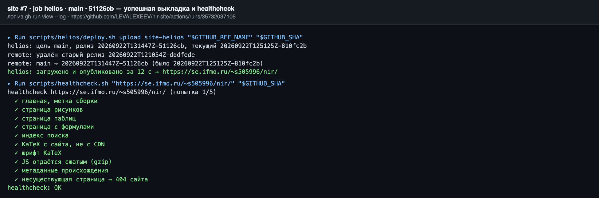

**Проваленный запуск с автооткатом** ([#5](https://github.com/LEVALEXEEV/nir-site/actions/runs/35728276425)): healthcheck — failure, откат — success:

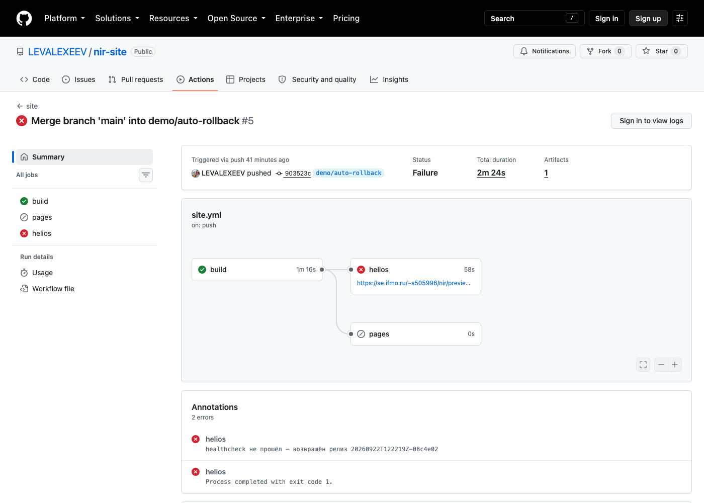

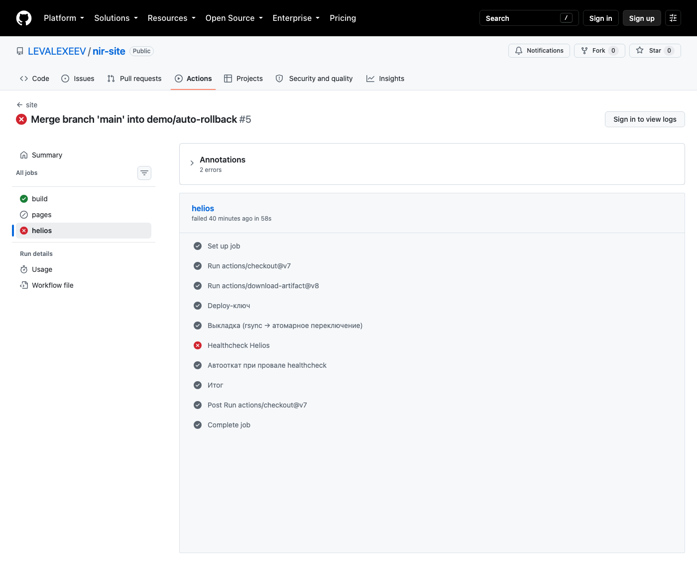

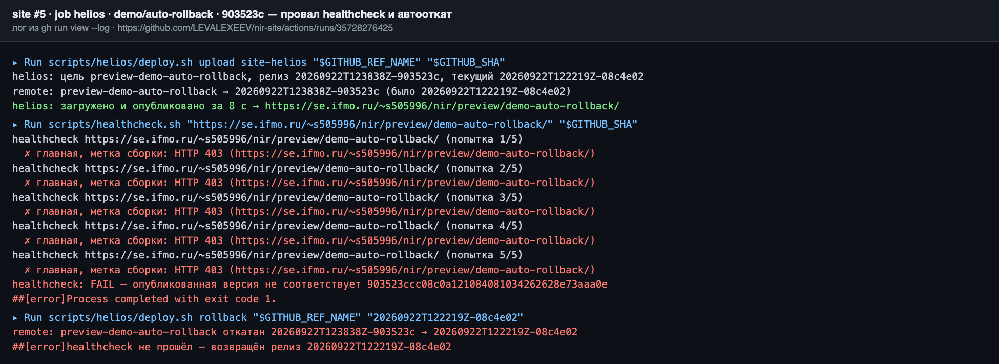

**Проваленный запуск до исправления** ([#3](https://github.com/LEVALEXEEV/nir-site/actions/runs/35726851267)): healthcheck завис, job отменена по таймауту, автооткат не выполнился (ошибка 7):

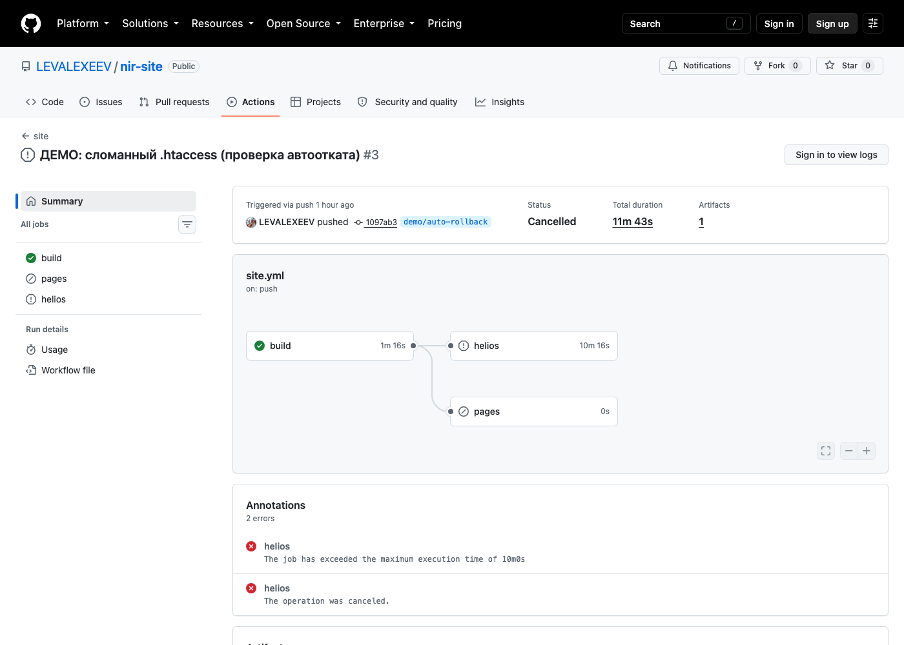

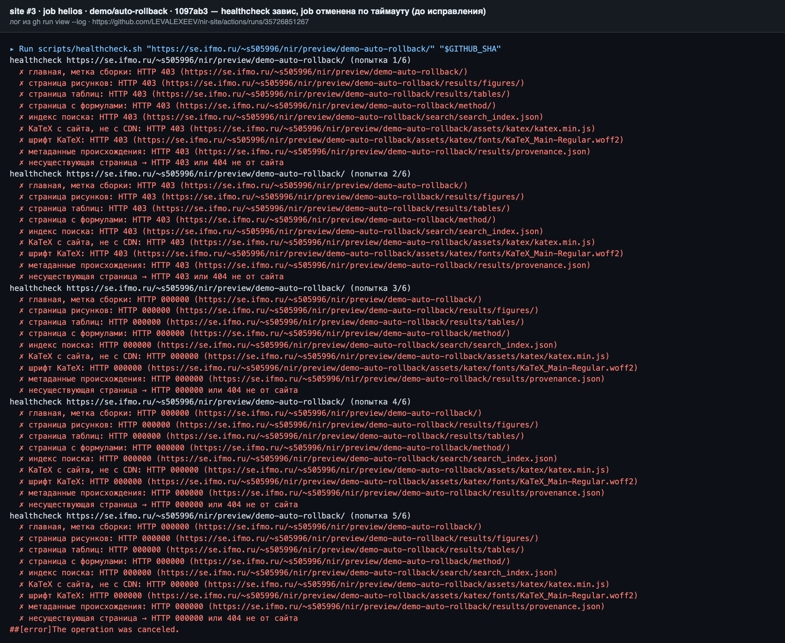

**Ручной откат** (`helios-ops`, [#1](https://github.com/LEVALEXEEV/nir-site/actions/runs/35728188877)):

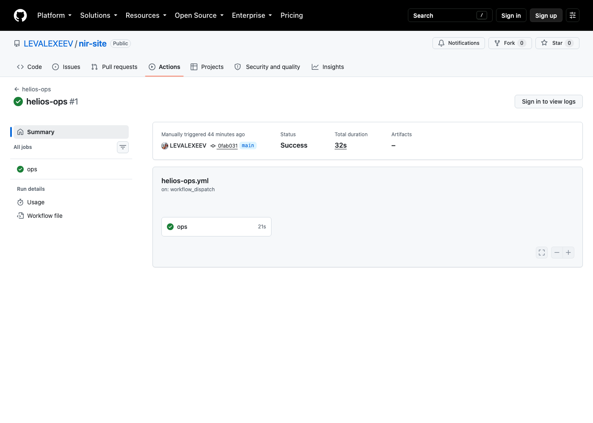

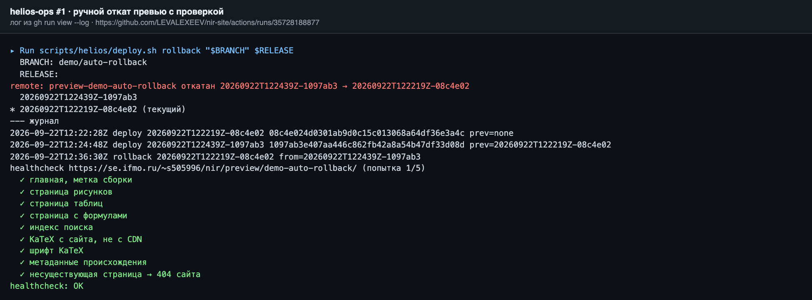

**Все запуски:**

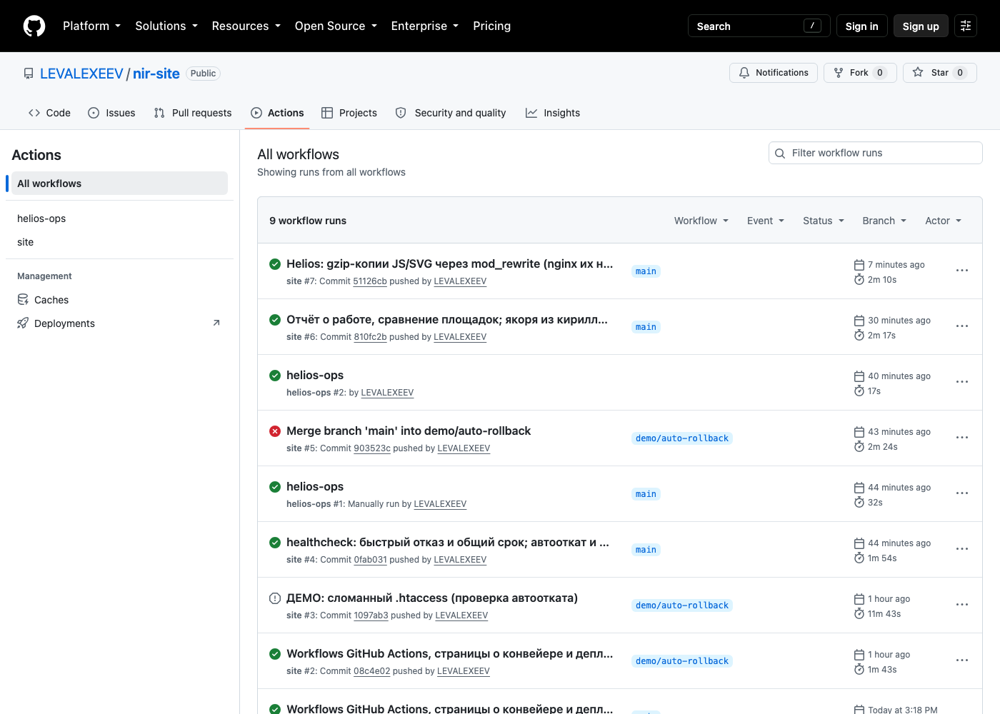

**Опубликованный сайт:** GitHub Pages (рисунки), Helios (формулы без CDN), 404 сайта на Helios:

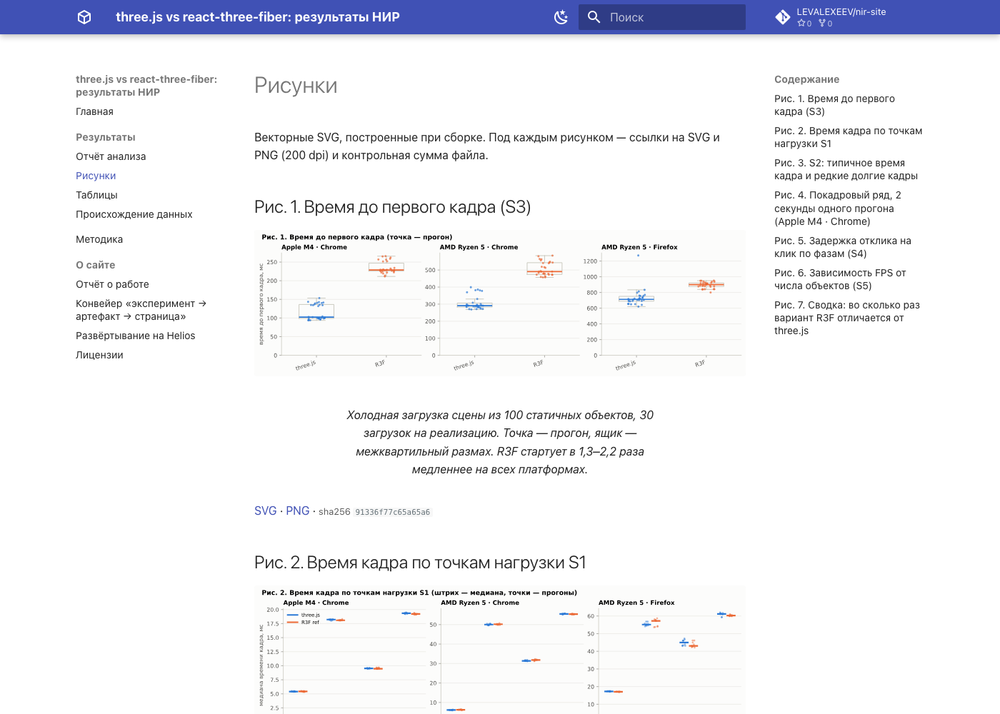

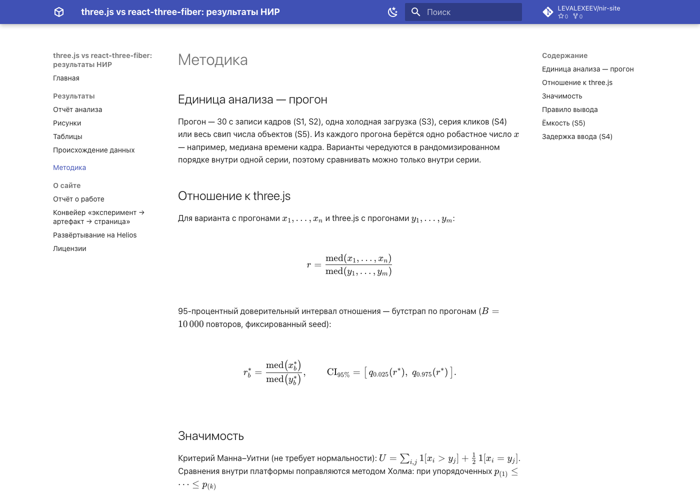

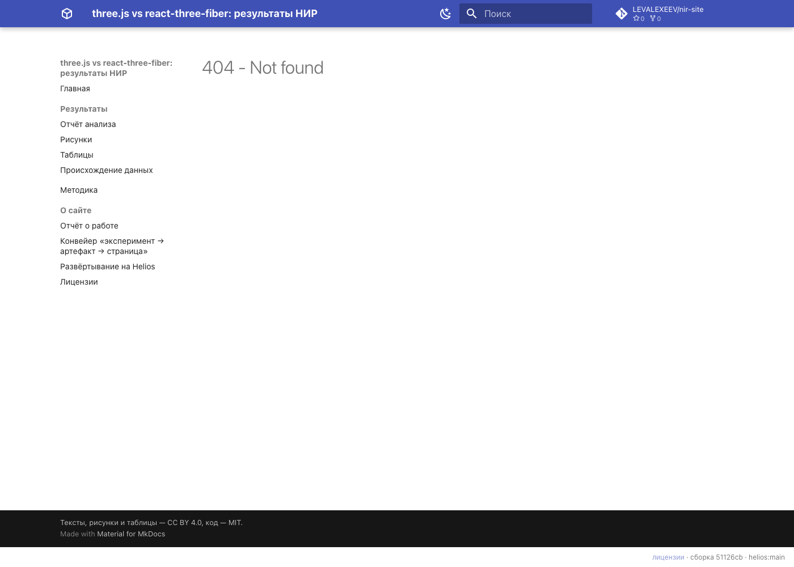

---

## 6. Отладка (ошибки, связанные с Helios)

### Ошибка 1. Ссылка «Лицензии» уводит с сайта при размещении в подкаталоге

**Текст ошибки.** `mkdocs build --strict` прошёл без предупреждений, а проверка собранного сайта выдала на всех 10 страницах:

```text
about/deploy/index.html: ссылка от корня домена <a href="/about/license/">
…
check_site: 11 страниц, ошибок 10
```

**Гипотеза.** Ссылка задана в `copyright` в `mkdocs.yml`. Это сырой HTML: MkDocs его не проверяет и не переписывает относительно `site_url`. На Pages (`/nir-site/`) и на Helios (`/~s505996/nir/`) она ведёт в корень домена, мимо сайта — «типичная ошибка» подкаталога.

**Проверка.** `curl https://se.ifmo.ru/about/license/` → `HTTP 404`, заголовок страницы «Главная — Программная инженерия — Кафедра ВТ», то есть посетитель попадает на чужой сайт кафедры.

**Решение.** Ссылка перенесена в шаблон `overrides/main.html` как `{{ base_url }}/about/license/`; в `copyright` остался только текст. `scripts/check_site.py` (запрет `href="/…"` и внешних ресурсов) оставлен шагом CI для обеих площадок.

### Ошибка 2. На Helios несуществующая страница — заглушка сервера, а не 404 сайта

**Текст ошибки.** Первая версия healthcheck проверяла только код и проходила (`✓ несуществующая страница → 404`), но ручной запрос показал, что отвечает не сайт, а заглушка веб-сервера — без стилей и навигации:

```text
HTTP/2 404 · <title>404 Not Found</title> · <h1>Not Found</h1>
```

**Гипотеза.** GitHub Pages сам отдаёт `404.html` из корня сайта, а Apache на Helios о нём не знает. Если Apache учитывает `.htaccess` в `public_html`, хватит `ErrorDocument`.

**Проверка.** В каталог текущего релиза на сервере вручную положен `.htaccess` с `ErrorDocument 404 /~s505996/nir/404.html` → несуществующий путь вернул 404 с `<title>` сайта. `.htaccess` учитывается, перед Apache стоит `nginx/1.30.4`.

**Решение.** `deploy.sh` генерирует `.htaccess` при каждой выкладке: путь к `404.html` абсолютный и у каждой цели свой (корень или `preview/<ветка>/`), поэтому он не лежит в `docs/`. Healthcheck усилен: теперь он проверяет, что в теле 404 есть метка сайта (`name="nir-build"`).

### Ошибка 3. Первый деплой: `unbound variable`

**Текст ошибки.**

```text
helios: цель main, релиз 20260922T120714Z-8fe5f40, текущий нет
scripts/helios/deploy.sh: line 54: link[@]: unbound variable
```

**Гипотеза.** При первом деплое предыдущего релиза нет, массив флагов `--link-dest` пуст, а системный bash 3.2 на macOS при `set -u` считает раскрытие пустого массива обращением к неопределённой переменной (в bash ≥ 4.4 так не происходит — в CI на Ubuntu ошибки не было бы).

**Проверка.** `/bin/bash --version` → 3.2.57; `bash -c 'set -u; a=(); echo "${a[@]}"'` → `a[@]: unbound variable`; ошибка возникает только при пустом `$prev` (первый деплой цели).

**Решение.** Раскрытие `${link[@]+"${link[@]}"}` — работает во всех версиях bash. Повторный деплой прошёл за 3 с.

### Ошибка 4. Выкладка прошла, но скрипт завершился с кодом 1

**Текст ошибки.**

```text
remote: main → 20260922T120721Z-8fe5f40 (было ничего)
helios: загружено и опубликовано за 3 с → https://se.ifmo.ru/~s505996/nir/
Exit code 1
```

**Гипотеза.** Последняя команда ветки `upload` — `[ -n "${GITHUB_OUTPUT:-}" ] && { … }`. Вне CI переменная пуста, `[` возвращает 1, и это становится кодом выхода скрипта (под `set -e` конструкция `a && b` не прерывает скрипт, но её статус — последний).

**Проверка.** Сайт отдавал новую метку сборки (healthcheck OK), значит выкладка прошла; модельный пример `f(){ [ -n "" ] && echo x; }; f; echo $?` печатает `1`.

**Решение.** `if [ -n "${GITHUB_OUTPUT:-}" ]; then …; fi`. Без исправления локальная выкладка «падала» бы, а в CI это прошло бы незамеченным.

### Ошибка 5. `list` на сервере: `parameter not set`

**Текст ошибки.**

```text
$ deploy.sh list main
sh: target: parameter not set
```

**Гипотеза.** На Helios `/bin/sh` — FreeBSD sh. В строке `target=$1 cur=$(current_id "$target")` все подстановки выполняются до присваиваний, поэтому `$target` ещё не задан, а `set -u` это запрещает.

**Проверка.** На Helios `sh -c 'set -u; a=1 b=$a; echo b=$b'` → `sh: a: parameter not set`; та же строка в bash → `b=1`. Остальные команды скрипта (`prepare`, `activate`) не зависели от порядка и работали.

**Решение.** Присваивания разнесены по отдельным строкам (в `list` и в `switch`), с комментарием, почему.

### Ошибка 6. Откат: «нет релиза для отката», хотя релизы есть

**Текст ошибки.**

```text
$ deploy.sh rollback main
remote: нет релиза для отката
```

**Гипотеза.** Откат ищет предыдущий релиз по журналу `history.log` через awk, `$2 == "deploy"`. Если формат строки другой, awk ничего не находит.

**Проверка.** `cat ~/nir-deploy/releases/main/history.log`:

```text
2026-09-22T12:07:24Z main deploy 20260922T120721Z-8fe5f40 8fe5f40… prev=none
```

Функция `log()` принимала имя цели первым аргументом (для выбора файла) и писала `$*` целиком, так что имя цели попало в журнал вторым полем, и действие сдвинулось в `$3`.

**Решение.** `log()` делает `shift` после выбора файла; старые строки журнала на сервере мигрированы `sed`. Заодно уточнена семантика: откат без аргумента возвращает релиз, **выложенный непосредственно перед текущим**, так что повторный откат уходит дальше в прошлое, а не переключает туда-обратно. Проверка после исправления: откат → снаружи метка `8fe5f40`, healthcheck с новой меткой падает; `rollback main <id>` → метка `6e6a477`.

### Ошибка 7. Healthcheck сломанной выкладки завис, job отменена — автооткат не выполнился

**Текст ошибки** (запуск [#3](https://github.com/LEVALEXEEV/nir-site/actions/runs/35726851267)):

```text
healthcheck … (попытка 1/6)
  ✗ главная, метка сборки: HTTP 403 (…)
… (попытка 3/6)
  ✗ главная, метка сборки: HTTP 000000 (…)      ← каждый запрос ждёт 20 с
##[error]The job has exceeded the maximum execution time of 10m0s
##[error]The operation was canceled.
```

Шаг «Автооткат при провале healthcheck» — `skipped`, превью осталось сломанным (403).

**Гипотеза.**

1. Первые две попытки получили 403 быстро (~1 с), а с третьей соединения стали обрываться по таймауту. Значит, se.ifmo.ru после серии ошибочных запросов перестаёт отвечать IP runner'а. Healthcheck делал 9 запросов × 6 попыток с `--max-time 20`, то есть до 18 мин.
2. Job, снятая по таймауту, получает статус `cancelled`, а шаг отката стоял под `if: failure()`, который для отменённой job ложен.
3. `000000` — `curl -w '%{http_code}'` сам печатает `000` при ошибке соединения, и `|| echo 000` дописывал второй.

**Проверка.** С машины автора тот же URL в это время отвечал 403 за 1,3 с (блокировался только адрес runner'а). По временным меткам лога шаг попытки 3 длился 20 с на запрос. В логе job шаг отката — `skipped` при статусе job `cancelled`.

**Решение.**

- healthcheck прекращает попытку при первой неудаче главной: если версия не та, остальное проверять незачем, и запросов к серверу в 9 раз меньше;
- `--connect-timeout 5 --max-time 10` и общий срок 150 с;
- у шага healthcheck — свой `timeout-minutes: 4`: упавший по таймауту шаг получает `failure`, а не отмену всей job;
- откат выполняется при `failure() || cancelled()`; `|| echo 000` заменён на `|| true`.

Проверка исправления — запуск [#5](https://github.com/LEVALEXEEV/nir-site/actions/runs/35728276425): провал за 44 с, откат за 2 с, превью снова отдаёт 200. Сломанное превью после запуска #3 возвращено ручным откатом через `helios-ops`.

### Ошибка 8. На Helios JS и SVG передаются без сжатия — страницы в 1,4–3,9 раза тяжелее, чем на Pages

**Текст ошибки.** Замер веса страниц: главная — 191 КБ на Pages против 489 КБ на Helios, «Рисунки» — 339 КБ против 1311 КБ. Заголовки ответа Helios:

```text
index.html              content-encoding: gzip
main.….min.css          content-encoding: gzip
search_index.json       content-encoding: gzip
bundle.d7400e89.min.js  content-length: 114286     ← без сжатия (Pages: 35252 в gzip)
03_s2_frame.svg         content-length: 185234     ← без сжатия (Pages: 28106 в gzip)
```

**Гипотеза.** Сжимает внешний nginx, и в его `gzip_types` нет `application/javascript` и `image/svg+xml`. Добавить типы через `.htaccess` (`AddOutputFilterByType DEFLATE`) можно, только если в Apache загружен mod_deflate.

**Проверка.**

1. `AddOutputFilterByType DEFLATE …` внутри `<IfModule mod_deflate.c>` → ничего не изменилось; та же директива без `IfModule` → `HTTP 500`. Значит, mod_filter/mod_deflate в Apache нет.
2. Директивы проверены по одной в отдельном тестовом каталоге `~/public_html/htest`: `RewriteEngine`, `Header`, `AddEncoding`, `AddType`, `SetEnv` → 200; `ExpiresActive`, `Options` → 500.
3. Там же схема с заранее сжатыми файлами: `b.min.js` 114 286 → 34 907 Б, `f.svg` 199 505 → 32 557 Б, `Content-Type` сохранён, `Content-Encoding: gzip`, `Vary: Accept-Encoding`; без `Accept-Encoding: gzip` отдаётся несжатый файл; распакованный JS побайтно совпадает с исходным.

**Решение.**

- `deploy.sh` перед выкладкой кладёт рядом `.js.gz` и `.svg.gz` (`gzip -9 -n`: без имени и времени в заголовке, чтобы у неизменённого файла был тот же `.gz` и `--link-dest` по-прежнему передавал только разницу);
- `.htaccess` через mod_rewrite отдаёт `.gz` браузерам, принимающим gzip (`RewriteBase` — под путь цели, `RemoveType .gz` + `AddEncoding gzip .gz`, `Header append Vary`);
- в healthcheck добавлена проверка «JS отдаётся сжатым».

Результат — таблица 2.3: главная 489 → 217 КБ, «Рисунки» 1311 → 359 КБ.

### Ошибка 9. `--link-dest` не связывал ни одного файла: каждый деплой передавал весь сайт

**Текст ошибки.** Явного сообщения нет — обнаружено при подсчёте жёстких ссылок в опубликованном релизе:

```text
$ find . -type f | wc -l          → 166
$ find . -type f -links +1 | wc -l → 0        ← общих с прошлыми релизами файлов нет
$ du -sh ~/nir-deploy              → 18M      ← 5 релизов по 3,9 МБ, экономии нет
```

**Гипотеза.** Флаг `--link-dest` связывает файл с прошлым релизом, только если файл признан неизменившимся. Быстрая проверка rsync — размер и время изменения. В команде было `rsync -rlz`, без `-t`: время не сохраняется, у файлов на сервере оно своё, и при следующем деплое всё выглядит изменившимся.

**Проверка.**

1. Добавлен `-t`, два деплоя одного и того же каталога сборки подряд → 165 общих файлов из 166, каталог релизов 18 → 12 МБ. Гипотеза подтвердилась.
2. Но в CI по-прежнему 0 из 166. Отличие: CI каждый раз генерирует файлы заново, и время у них новое. Itemize-вывод `rsync -i` показал флаг `t` у всех файлов — расходится именно время.
3. Время нормализовано (`touch -t 202601010000` для всех файлов) — локально связывание есть, в CI снова 0. Сравнение времени файлов на сервере (`stat`) показало разницу ровно в 3 часа: `touch -t` берёт **местное** время, машина автора в UTC+3, раннер — в UTC.

**Решение.**

- `rsync -rltz --checksum`: `-t` сохраняет время, `--checksum` сравнивает содержимое, а не размер и время. Второе обязательно: метка сборки — sha фиксированной длины, поэтому изменённая страница имеет **тот же размер**, и без `--checksum` при одинаковом времени она не была бы передана (проверено подстановкой другого sha той же длины — страница доехала);
- `find "$site" -exec env TZ=UTC touch -h -t 202601010000 {} +` — время всех файлов приводится к одному значению в UTC, независимо от часового пояса машины;
- нормализация выполняется после генерации `.htaccess`, иначе он один остаётся с текущим временем.

**Результат.** Между двумя запусками CI подряд переиспользуются 162 файла из 166. Не связываются только те, что действительно меняются каждую сборку: `results/provenance.json` и страница происхождения (в них время сборки и ссылка на запуск CI), индекс поиска и `.htaccess`.

---

## 7. Вывод

### 7.1. Рекомендуемый стек для публикации результатов исследований производительности веб-графики

| Слой | Рекомендация | Почему |
|---|---|---|
| Замеры | на реальных устройствах, вне CI; сырые результаты (JSON + манифест серии с коммитом стенда, устройством, браузером) — в git репозитория стенда | CI-runner не даёт GPU, дисплея и стабильного железа (раздел 3.2) |
| Анализ | Jupyter-ноутбук + модуль с функциями анализа, фиксированный seed, lock-файл зависимостей | воспроизводимость; проверено совпадением 14/14 таблиц |
| Связка «данные → страница» | подмодуль с данными на фиксированном коммите; исполнение ноутбука в CI (nbconvert) + скрипт-генератор страниц с подписями и `provenance.json` | опубликованное число всегда следует из закоммиченных данных |
| Генератор | MkDocs + Material, `--strict`, KaTeX и шрифты локально, `check_site.py` | простой Markdown, русский поиск, формулы без CDN |
| CI | GitHub Actions, публичный репозиторий, кэш pip | бесплатно, ~2 мин от push до сайта |
| Хостинг | GitHub Pages (`upload-pages-artifact` + `deploy-pages`) как основной + Helios как зеркало с превью и откатом (rsync, релизы, атомарный симлинк) | Pages — надёжность и CDN; Helios — превью, откат < 1 с, не зависит от доступности зарубежных сервисов |
| Контроль доставки | healthcheck с меткой сборки после каждой выкладки, автооткат | ловит то, чего не видит сборка (ошибки 7, 8) |

### 7.2. Когда рекомендация меняется

| Условие | Что меняется |
|---|---|
| Сырые данные > ~1 ГБ (лимит рекомендуемого размера репозитория) или > ~10 ГБ (диск runner) | данные — в DVC / git-annex / S3 с хешем в git; CI скачивает только сводки или считает на self-hosted runner |
| Анализ дольше ~15 мин, нужен GPU или > 16 ГБ RAM | стратегия B целиком: анализ на своём железе или self-hosted runner, в git — готовые рисунки и таблицы с `provenance.json`; CI только собирает сайт |
| Репозиторий приватный (неопубликованные данные, NDA) | минуты CI платные сверх 2000/мес; Pages для приватных — только на платных планах → основной хостинг Helios или внутренний сервер с доступом по логину |
| Нужны интерактивные графики, фильтры по данным | Quarto или Jupyter Book (MyST-NB) с Plotly/Vega; рост веса страниц — отслеживать тем же замером |
| Отчёт с перекрёстными ссылками, библиографией, выпуском в PDF | Sphinx + MyST или Quarto вместо MkDocs |
| Однотипные отчёты по многим срезам (устройство × браузер × сценарий) | papermill + `strategy.matrix` в CI |
| Аудитория в сетях, где GitHub/CDN недоступны или нестабильны | Helios (или другой отечественный хостинг) — основной, Pages — зеркало |
| Хостинг без SSH/rsync и симлинков (только FTP / веб-загрузка) | атомарный деплой и откат через симлинк невозможны → выкладка во временный каталог + переименование каталога, если хостинг позволяет; иначе — Pages как основной |
| Деплой копирует полный сайт при каждой выкладке | проверять, что `--link-dest` действительно связывает файлы (`find -links +1`): без `-t`, `--checksum` и одинакового времени файлов он молча не работает (ошибка 9) |
| Сервер не сжимает часть типов и нет mod_deflate (как на Helios) | заранее сжатые `.gz` + mod_rewrite (решение ошибки 8); без mod_rewrite — минимизировать SVG / переходить на WebP |

---

## Приложение. Скрипты, вызываемые пайплайнами

### `scripts/helios/deploy.sh` — клиентская часть деплоя

```bash
#!/usr/bin/env bash
# Выкладка собранного сайта на Helios по SSH/rsync.
#
#   deploy.sh upload <site_dir> <branch> <sha>   загрузить релиз и опубликовать
#   deploy.sh rollback <branch> [release_id]    вернуть предыдущий (или указанный) релиз
#   deploy.sh list <branch>                     релизы и журнал
#   deploy.sh remove <branch>                   удалить превью ветки
#   deploy.sh target <branch>                   имя цели и публичный URL (для CI)
#
# Ключ: HELIOS_KEY (путь к приватному deploy-ключу) или ssh-agent.
# Хост проверяется по known_hosts (в CI — из секрета), без слепого доверия.
set -euo pipefail

HOST=${HELIOS_HOST:-helios.cs.ifmo.ru}
PORT=${HELIOS_PORT:-2222}
USER_=${HELIOS_USER:-s505996}
BASE_URL=${HELIOS_BASE_URL:-https://se.ifmo.ru/~s505996/nir/}
MAIN_BRANCH=${MAIN_BRANCH:-main}
HERE="$(cd "$(dirname "$0")" && pwd)"

SSH_OPTS=(-p "$PORT" -o BatchMode=yes -o StrictHostKeyChecking=yes -o ConnectTimeout=20
          -o ServerAliveInterval=15 -o ServerAliveCountMax=4)
[ -n "${HELIOS_KEY:-}" ] && SSH_OPTS+=(-i "$HELIOS_KEY" -o IdentitiesOnly=yes)
[ -n "${HELIOS_KNOWN_HOSTS:-}" ] && SSH_OPTS+=(-o UserKnownHostsFile="$HELIOS_KNOWN_HOSTS")

# ветка → цель и URL: основная ветка в корень, остальные — в preview/<slug>/
target_of() {
  if [ "$1" = "$MAIN_BRANCH" ]; then echo main; return; fi
  local slug
  slug=$(printf '%s' "$1" | tr '[:upper:]' '[:lower:]' | sed -E 's/[^a-z0-9]+/-/g; s/^-+|-+$//g' | cut -c1-40)
  [ -n "$slug" ] || { echo "пустое имя ветки" >&2; exit 1; }
  echo "preview-$slug"
}
url_of() { [ "$1" = main ] && echo "$BASE_URL" || echo "${BASE_URL}preview/${1#preview-}/"; }

remote() { ssh "${SSH_OPTS[@]}" "$USER_@$HOST" sh -s -- "$@" < "$HERE/remote.sh"; }

cmd=${1:?команда}; shift
case "$cmd" in
  target)
    t=$(target_of "$1"); echo "target=$t"; echo "url=$(url_of "$t")" ;;

  upload)
    site=${1:?каталог сайта} branch=${2:?ветка} sha=${3:?коммит}
    [ -f "$site/index.html" ] || { echo "в $site нет index.html" >&2; exit 1; }
    t=$(target_of "$branch")
    id="$(date -u +%Y%m%dT%H%M%SZ)-${sha:0:7}"
    started=$(date +%s)
    # Apache Helios понимает .htaccess; путь к 404.html и RewriteBase — от корня
    # домена и свои у каждой цели (корень или preview/<slug>/), поэтому пишутся здесь
    path=$(url_of "$t" | sed -E 's#^https?://[^/]+##')
    # nginx перед Apache сжимает HTML/CSS/JSON, но не JS и SVG, а mod_deflate в
    # Apache не загружен (AddOutputFilterByType в .htaccess → 500). Поэтому
    # копии .gz готовятся здесь и отдаются через mod_rewrite тем, кто принимает gzip.
    # -n: без имени и времени в заголовке — у неизменённого файла тот же .gz,
    # и --link-dest по-прежнему передаёт только разницу
    find "$site" -type f \( -name '*.js' -o -name '*.svg' \) -exec gzip -9 -n -k -f {} +
    cat > "$site/.htaccess" <<HTACCESS
ErrorDocument 404 ${path}404.html
RewriteEngine On
RewriteBase ${path}
RewriteCond %{HTTP:Accept-Encoding} gzip
RewriteCond %{REQUEST_FILENAME}.gz -f
RewriteRule ^(.+\.(js|svg))\$ \$1.gz [L]
RemoveType .gz
AddEncoding gzip .gz
<FilesMatch "\.(js|svg)(\.gz)?\$">
  Header append Vary Accept-Encoding
</FilesMatch>
HTACCESS
    prev=$(remote prepare "$t")
    echo "helios: цель $t, релиз $id, текущий ${prev:-нет}"
    # новый релиз — отдельный каталог; неизменённые файлы — жёсткие ссылки на
    # текущий релиз (--link-dest), так что передаётся только разница
    link=(); [ -n "$prev" ] && link=(--link-dest="../$prev")
    # RSYNC_EXTRA — доп. флаги (например, --bwlimit для демонстрации обрыва)
    rsync -rlz --delete --partial --timeout=120 ${RSYNC_EXTRA:-} ${link[@]+"${link[@]}"} \
      --chmod=Du=rwx,Dgo=rx,Fu=rw,Fgo=r \
      -e "ssh ${SSH_OPTS[*]}" "$site/" "$USER_@$HOST:nir-deploy/releases/$t/.incoming-$id/"
    remote activate "$t" "$id" "$sha"
    echo "helios: загружено и опубликовано за $(( $(date +%s) - started )) с → $(url_of "$t")"
    if [ -n "${GITHUB_OUTPUT:-}" ]; then
      { echo "release=$id"; echo "previous=$prev"; echo "url=$(url_of "$t")"; } >> "$GITHUB_OUTPUT"
    fi
    ;;

  rollback) remote rollback "$(target_of "${1:?ветка}")" ${2:+"$2"} ;;
  list)     remote list "$(target_of "${1:?ветка}")" ;;
  remove)   remote remove "$(target_of "${1:?ветка}")" ;;
  *) echo "команда: upload | rollback | list | remove | target" >&2; exit 2 ;;
esac
```

### `scripts/helios/remote.sh` — серверная часть (FreeBSD sh, передаётся по ssh)

```sh
#!/bin/sh
# Серверная часть деплоя на Helios (FreeBSD, /bin/sh). Не устанавливается на
# сервер, а передаётся по ssh при каждом вызове: `ssh helios sh -s -- cmd … < remote.sh`,
# поэтому логика версионируется вместе с сайтом.
#
# Раскладка (DEPLOY_ROOT=~/nir-deploy):
#   releases/<target>/<id>/        полные копии сайта; <target> = main | preview-<slug>
#   releases/<target>/.incoming-*  недокачанный релиз (обрыв rsync) — не публикуется
#   releases/<target>/history.log  журнал: время, действие, id, коммит
#   live/main                      → ../releases/main/<id>      (~/public_html/nir → сюда)
#   live/preview/<slug>            → ../../releases/preview-<slug>/<id>
# Каждый релиз main содержит ссылку preview → live/preview, поэтому превью
# доступны как …/nir/preview/<slug>/. Публикация = атомарная замена симлинка
# (rename), так что посетитель видит либо старую версию, либо новую целиком.
set -eu

ROOT="$HOME/nir-deploy"
PUBLIC_LINK="$HOME/public_html/nir"
KEEP=5

die() { echo "remote: $*" >&2; exit 1; }

live_link() {  # путь симлинка, через который публикуется цель
  case "$1" in
    main) echo "$ROOT/live/main" ;;
    preview-*) echo "$ROOT/live/preview/${1#preview-}" ;;
    *) die "неизвестная цель $1" ;;
  esac
}

current_id() { l=$(live_link "$1"); [ -L "$l" ] && basename "$(readlink "$l")" || true; }

switch() {  # switch <target> <id>: атомарно направить live-ссылку на релиз
  target=$1 id=$2
  link=$(live_link "$target")
  rel="$ROOT/releases/$target/$id"
  [ -d "$rel" ] || die "нет релиза $target/$id"
  mkdir -p "$(dirname "$link")"
  ln -sfn "$rel" "$link.tmp.$$"
  mv -fh "$link.tmp.$$" "$link"   # rename(2): атомарно, без окна «сайта нет»
}

log() {  # log <target> <действие> <id> …: строка «время действие id …» в журнал цели
  f="$ROOT/releases/$1/history.log"; shift
  echo "$(date -u +%Y-%m-%dT%H:%M:%SZ) $*" >> "$f"
}

cmd=${1:-}; shift || true
case "$cmd" in
  prepare)  # prepare <target>: каталоги, убрать обрывки прошлых деплоев, вывести id текущего релиза
    target=$1
    mkdir -p "$ROOT/releases/$target" "$ROOT/live/preview"
    chmod 755 "$HOME" "$ROOT" "$ROOT/releases" "$ROOT/releases/$target" "$ROOT/live" "$ROOT/live/preview"
    for d in "$ROOT/releases/$target"/.incoming-*; do
      [ -e "$d" ] || continue
      echo "remote: удаляю недокачанный релиз $(basename "$d")" >&2
      rm -rf "$d"
    done
    if [ "$target" = main ] && [ -e "$PUBLIC_LINK" ] && [ ! -L "$PUBLIC_LINK" ]; then
      die "$PUBLIC_LINK — не симлинк; не трогаю чужие файлы"
    fi
    current_id "$target"
    ;;

  activate)  # activate <target> <id> <sha>: принять загруженный релиз и опубликовать его
    target=$1 id=$2 sha=$3
    dir="$ROOT/releases/$target"
    [ -d "$dir/.incoming-$id" ] || die "нет загруженного $target/.incoming-$id"
    [ -f "$dir/.incoming-$id/index.html" ] || die "в релизе нет index.html — загрузка неполная"
    [ "$target" = main ] && ln -sfn "$ROOT/live/preview" "$dir/.incoming-$id/preview"
    mv "$dir/.incoming-$id" "$dir/$id"
    prev=$(current_id "$target")
    switch "$target" "$id"
    [ "$target" = main ] && [ ! -L "$PUBLIC_LINK" ] && ln -s "$ROOT/live/main" "$PUBLIC_LINK"
    log "$target" "deploy $id $sha prev=${prev:-none}"
    # чистка: хранятся KEEP последних релизов; текущий и предыдущий не удаляются никогда
    ls -1 "$dir" | grep -v '^history.log$' | sort -r | tail -n +$((KEEP + 1)) | while read -r old; do
      [ "$old" = "$id" ] || [ "$old" = "$prev" ] || { rm -rf "${dir:?}/$old"; echo "remote: удалён старый релиз $old" >&2; }
    done
    echo "remote: $target → $id (было ${prev:-ничего})"
    ;;

  rollback)  # rollback <target> [id]: вернуть указанный релиз или предыдущий по журналу
    target=$1 want=${2:-}
    cur=$(current_id "$target")
    if [ -z "$want" ]; then
      # предыдущий = выложенный непосредственно перед текущим (по записям deploy);
      # повторный откат уходит дальше в прошлое, а не переключает туда-обратно
      want=$(awk -v cur="$cur" '$2=="deploy"{ if ($3==cur) { print prev; exit } prev=$3 }' \
             "$ROOT/releases/$target/history.log")
      [ -n "$want" ] && [ -d "$ROOT/releases/$target/$want" ] || die "нет релиза для отката (до $cur)"
    fi
    switch "$target" "$want"
    log "$target" "rollback $want from=$cur"
    echo "remote: $target откатан $cur → $want"
    ;;

  list)  # list <target>: релизы и журнал
    # отдельными командами: sh выполняет подстановки до присваиваний в той же строке
    target=$1
    cur=$(current_id "$target")
    for r in $(ls -1 "$ROOT/releases/$target" | grep -v '^history.log$' | sort -r); do
      [ "$r" = "$cur" ] && echo "* $r (текущий)" || echo "  $r"
    done
    echo "--- журнал"; tail -n 10 "$ROOT/releases/$target/history.log" 2>/dev/null || true
    ;;

  remove)  # remove <target>: удалить превью ветки целиком (ветка удалена)
    target=$1
    case "$target" in preview-*) ;; *) die "удалять можно только превью" ;; esac
    rm -f "$(live_link "$target")"
    rm -rf "${ROOT:?}/releases/$target"
    echo "remote: превью $target удалено"
    ;;

  *) die "команда: prepare | activate | rollback | list | remove" ;;
esac
```

### `scripts/healthcheck.sh`

```bash
#!/usr/bin/env bash
# Проверка опубликованного сайта «снаружи», как его видит посетитель.
#   healthcheck.sh <url> <expected_sha>
# Падает (exit 1), если хоть одна проверка не прошла за все попытки.
# Повторы нужны из-за кэшей: CDN GitHub Pages отдаёт новую версию не мгновенно.
# Если главная не отвечает как надо, попытка прерывается сразу: se.ifmo.ru
# перестаёт отвечать IP, с которого идёт серия ошибочных запросов, а десятки
# запросов с таймаутом по 20 с выводили job за её лимит (и автооткат не выполнялся).
set -uo pipefail

URL=${1:?url}; SHA=${2:?sha}
URL="${URL%/}/"
ATTEMPTS=${HC_ATTEMPTS:-5}; DELAY=${HC_DELAY:-10}; DEADLINE=$(( $(date +%s) + ${HC_DEADLINE:-150} ))
TMP=$(mktemp -d); trap 'rm -rf "$TMP"' EXIT

fetch() {  # fetch <path> → код ответа; тело в $TMP/body
  # при ошибке соединения curl сам печатает 000 — «|| echo 000» дал бы 000000
  curl -sS -L --connect-timeout 5 --max-time 10 -H 'Cache-Control: no-cache' -o "$TMP/body" -w '%{http_code}' "$URL$1?hc=$RANDOM" 2>"$TMP/err" || true
}

check() {
  local fails=0 code
  expect() {  # expect <path> <описание> [строка в теле]
    code=$(fetch "$1")
    if [ "$code" != 200 ]; then echo "  ✗ $2: HTTP $code ($URL$1)"; fails=$((fails + 1)); return; fi
    if [ -n "${3:-}" ] && ! grep -qF -- "$3" "$TMP/body"; then
      echo "  ✗ $2: HTTP 200, но нет «$3»"; fails=$((fails + 1)); return
    fi
    echo "  ✓ $2"
  }
  # контрольная строка — метка именно этой сборки, а не любой прошлой
  # SHA может быть коротким (откат по id релиза) — сравнивается префикс
  expect "" "главная, метка сборки" "<meta name=\"nir-build\" content=\"$SHA"
  [ "$fails" = 0 ] || return 1   # не та версия или сайт недоступен — остальное проверять незачем
  expect "results/figures/" "страница рисунков" "Рис. 1."
  expect "results/tables/" "страница таблиц" "Таблица 13."
  expect "method/" "страница с формулами" 'class="arithmatex"'
  expect "search/search_index.json" "индекс поиска" "three.js"
  expect "assets/katex/katex.min.js" "KaTeX с сайта, не с CDN"
  expect "assets/katex/fonts/KaTeX_Main-Regular.woff2" "шрифт KaTeX"
  # главный бандл JS должен приходить сжатым (на Helios — через .gz-копии, см. deploy.sh)
  bundle=$(fetch "" >/dev/null; grep -o 'assets/javascripts/bundle\.[0-9a-f]*\.min\.js' "$TMP/body" | head -1)
  if curl -s -o /dev/null -D - -H 'Accept-Encoding: gzip' --max-time 10 "$URL$bundle" | grep -qi '^content-encoding: gzip'; then
    echo "  ✓ JS отдаётся сжатым (gzip)"
  else echo "  ✗ $bundle отдаётся без сжатия"; fails=$((fails + 1)); fi
  expect "results/provenance.json" "метаданные происхождения" '"results_tree"'
  # 404 должна быть страницей сайта (со стилями по site_url), а не заглушкой веб-сервера
  code=$(fetch "no-such-page-$RANDOM/")
  if [ "$code" = 404 ] && grep -qF 'name="nir-build"' "$TMP/body"; then echo "  ✓ несуществующая страница → 404 сайта"
  else echo "  ✗ несуществующая страница → HTTP $code или 404 не от сайта"; fails=$((fails + 1)); fi
  return "$fails"
}

for i in $(seq 1 "$ATTEMPTS"); do
  echo "healthcheck $URL (попытка $i/$ATTEMPTS)"
  if check; then echo "healthcheck: OK"; exit 0; fi
  if [ "$i" -lt "$ATTEMPTS" ] && [ $(( $(date +%s) + DELAY )) -lt "$DEADLINE" ]; then sleep "$DELAY"; else break; fi
done
echo "healthcheck: FAIL — опубликованная версия не соответствует $SHA" >&2
exit 1
```

### `Makefile`

```makefile
# Точка входа и для CI, и для локальной работы: workflow вызывает те же цели.
PY      ?= .venv/bin/python
MKDOCS  ?= .venv/bin/mkdocs
SITE_DIR ?= site

.PHONY: venv content site serve check clean

venv:
	virtualenv -p python3.13 .venv && .venv/bin/pip install -r requirements.txt

content:            ## исполнить ноутбук анализа и сгенерировать страницы docs/results
	$(PY) scripts/build_content.py

site: content       ## сборка в режиме --strict (предупреждения = ошибка)
	$(MKDOCS) build --strict --site-dir $(SITE_DIR)
	$(PY) scripts/check_site.py $(SITE_DIR)

serve: content
	$(MKDOCS) serve

check:              ## проверить уже собранный сайт
	$(PY) scripts/check_site.py $(SITE_DIR)

clean:
	rm -rf site site-* _work docs/results
```
