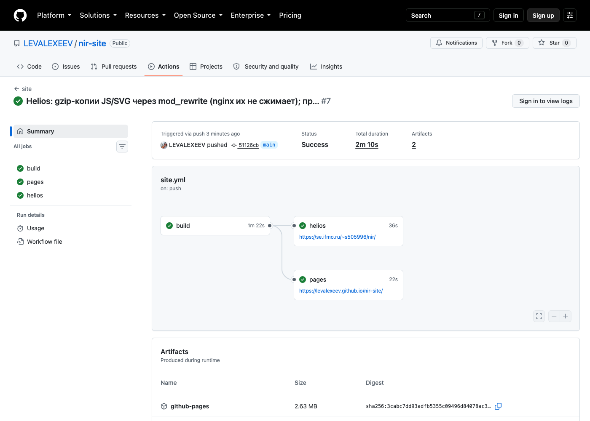
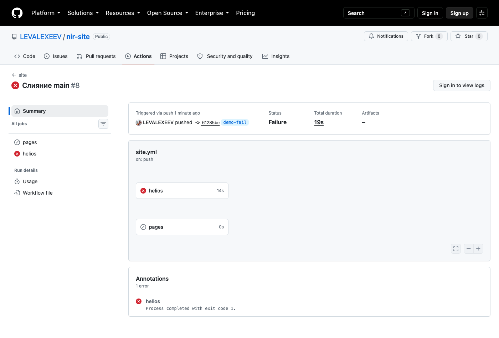
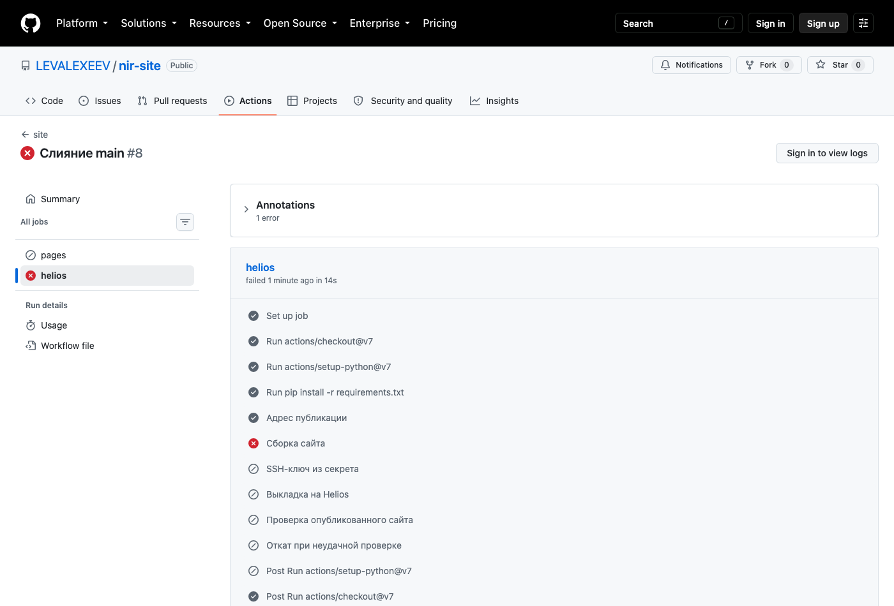
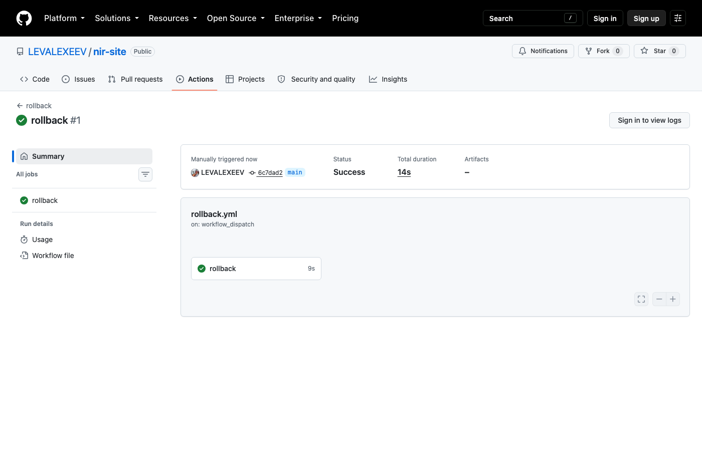
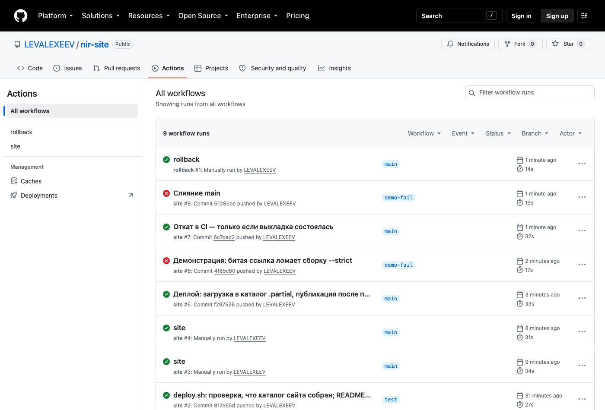
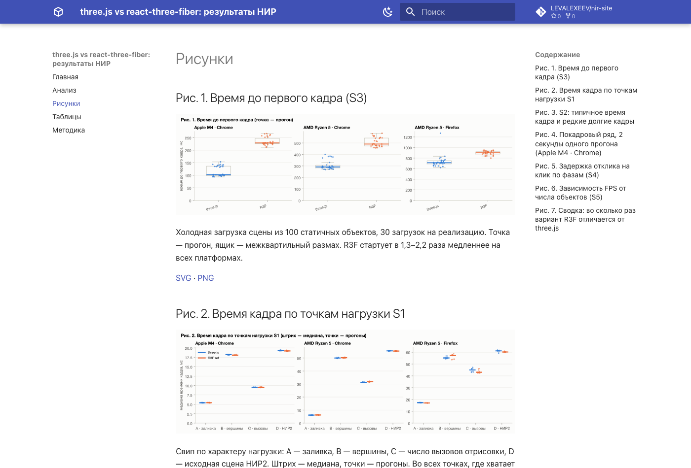
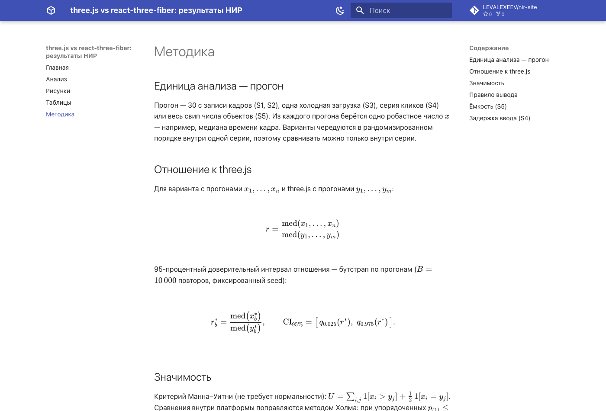
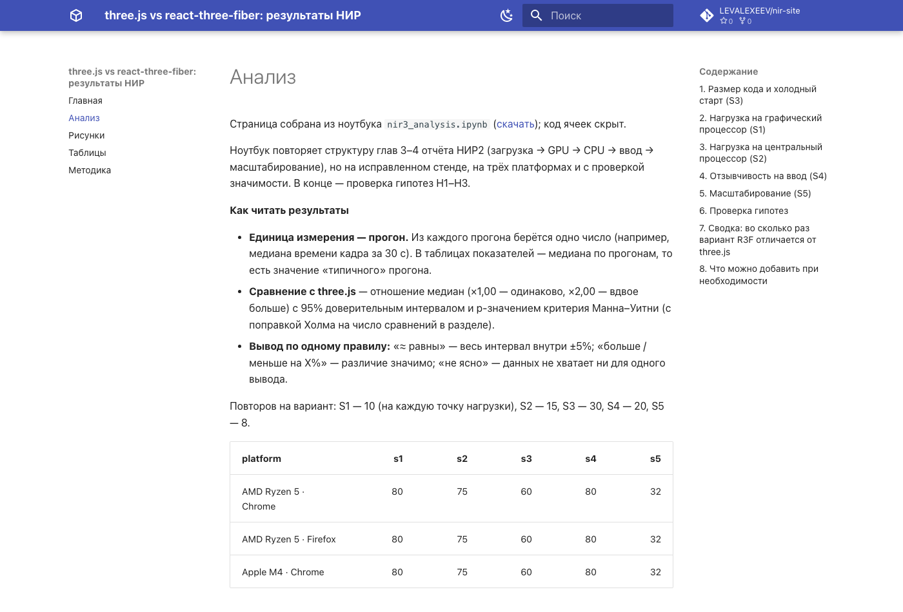

# Публикация результатов исследования статическим сайтом с развёртыванием на GitHub Pages и Helios ИТМО

**Исполнитель:** Лев Алексеев, s505996 · **Дата:** 22.09.2026
**Генератор статического сайта:** MkDocs 1.6.1 с темой Material 9.7.7, Python 3.13

## Ссылки

| Ресурс | Адрес |
|---|---|
| Репозиторий сайта | https://github.com/LEVALEXEEV/nir-site |
| Сайт на GitHub Pages | https://levalexeev.github.io/nir-site/ |
| Сайт на Helios ИТМО | https://se.ifmo.ru/~s505996/nir/ |
| Превью веток на Helios | `https://se.ifmo.ru/~s505996/nir-preview/<ветка>/` |
| Запуски CI | https://github.com/LEVALEXEEV/nir-site/actions |
| Репозиторий стенда, на котором получены данные | https://github.com/LEVALEXEEV/benchmark |

Сайт представляет результаты НИР по сравнению производительности императивного
three.js и декларативного react-three-fiber и содержит четыре раздела: «Анализ»
(отчёт, полученный из ноутбука Jupyter), «Рисунки» (7 графиков с подписями),
«Таблицы» (14 таблиц с подписями) и «Методика» (статистические процедуры с
формулами).

---

## 1. Ход работы

**1. Установка Python, проверка pip и virtualenv.** Выполнено: Python 3.13.7,
pip 25.2.

**2. Установка virtualenv.** Выполнено с уточнением: команда
`python3 -m pip install virtualenv` завершилась отказом, поскольку
интерпретатор, установленный через Homebrew, помечен как управляемый извне
(PEP 668). Принято решение установить virtualenv системным пакетным
менеджером (`brew install virtualenv`, версия 21.9.0) — этот способ указан в
документации virtualenv как основной для macOS. Все прочие пакеты
устанавливаются уже внутри виртуального окружения.

**3. Каталог проекта и виртуальное окружение.** Выполнено: каталог
`nir-site`, окружение создано командой `virtualenv -p python3.13 .venv`.

**4. Фиксация зависимостей и .gitignore.** Выполнено: `requirements.txt`
содержит две зависимости с точными версиями (`mkdocs-material==9.7.7`,
`pymdown-extensions==12.0.1`); MkDocs подтягивается как зависимость темы.
В `.gitignore` внесены виртуальное окружение, каталог сборки `site/`, кэши.

**5. Создание каркаса сайта.** Выполнено; потребовало трёх решений.

*Подготовка данных для публикации.* Результаты исследования (7 рисунков,
14 таблиц, текст анализа) получены ранее на стенде `benchmark` и хранятся в
виде ноутбука Jupyter с сохранёнными выводами. Ноутбук однократно
преобразован в страницу «Анализ» экспортом nbconvert без исполнения ячеек;
рисунки (SVG и PNG), таблицы (CSV) и сам файл `.ipynb` помещены в
`docs/assets/`. Таким образом, сборка сайта не выполняет вычислений: все
артефакты хранятся в репозитории в готовом виде. Обоснование выбора такой
схемы приведено в разделе 3.

*Отображение формул без внешних сетей.* Формулы на странице «Методика»
размечены расширением `pymdownx.arithmatex` в режиме `generic` и отрисовываются
библиотекой KaTeX 0.18.7, которая помещена в репозиторий (`docs/assets/katex`)
скриптом `scripts/vendor_katex.sh`. Внешние CDN не используются: ни библиотека,
ни шрифты, ни шрифты темы (параметр `font: false` отключает загрузку Google
Fonts) не запрашиваются со сторонних узлов. Это исключает отказ отображения
формул при недоступности CDN.

*Представление таблиц.* Таблицы преобразованы из CSV в разметку Markdown с
округлением до трёх значащих цифр; исходные CSV доступны для скачивания по
ссылке под каждой таблицей. Каждый рисунок и каждая таблица снабжены подписью.

**6. Проверка локальной сборки.** Выполнено: предпросмотр `mkdocs serve`,
сборка `mkdocs build --strict`. Режим `--strict` дополнительно закреплён
параметром `strict: true` в `mkdocs.yml`, поэтому он действует и при запуске
без флага.

**7. Инициализация репозитория и отправка на GitHub.** Выполнено: публичный
репозиторий `LEVALEXEEV/nir-site`.

**8. Настройка GitHub Actions.** Выполнено: в параметрах репозитория
Pages → Source установлено значение GitHub Actions. Сравнение двух подходов к
публикации приведено в п. 1.1; применён официальный подход
`upload-pages-artifact` + `deploy-pages`.

**9. Учётная запись Helios.** Выполнено с уточнением: сайт размещён не в корне
`~/public_html`, а в подкаталоге `nir/`, поскольку в каталоге уже находились
другие работы. Для развёртывания создана отдельная пара ключей ed25519;
открытый ключ добавлен в `~/.ssh/authorized_keys` на сервере, закрытый хранится
в секрете репозитория `HELIOS_SSH_KEY`. Пароль учётной записи в процессе
развёртывания не используется. Ключ узла зафиксирован в файле
`scripts/known_hosts`, режим `StrictHostKeyChecking` оставлен включённым.

**10. Корректировка workflow под целевую площадку.** Выполнено: задание
`helios` собирает сайт с базовым URL площадки, передаёт его по rsync и
проверяет результат; описание приведено в разделе 4.

**11. Настройка базового URL.** Выполнено; потребовало решения. Параметр
`site_url` задаётся при сборке через переменную окружения
(`site_url: !ENV [SITE_URL, ...]`), поэтому один и тот же исходный текст
собирается трижды с разными адресами: для GitHub Pages, для Helios и для
превью ветки. Параметр `use_directory_urls` оставлен включённым: адреса вида
`page/index.html` одинаково обрабатываются и GitHub Pages, и Apache.
Внутренние ссылки относительные, поэтому размещение в подкаталоге корректно;
от `site_url` зависят только канонические ссылки, карта сайта и страница 404.

**12. Проверка результата развёртывания.** Выполнено: после каждой публикации
сценарий `scripts/healthcheck.sh` запрашивает опубликованный адрес и
проверяет код ответа 200 и наличие контрольной строки
`<meta name="nir-build" content="<коммит>">`. Контрольная строка содержит
идентификатор коммита, поэтому проверяется не доступность сайта вообще, а
факт публикации именно текущей версии. Дополнительно в браузере Chromium с
заблокированными обращениями ко всем внешним узлам подтверждено, что все 19
формул раздела «Методика» отрисовываются, и что работает поиск по русским
запросам.

**13. Лицензии.** Выполнено: код (сценарии, конфигурация, workflow) — MIT
(файл `LICENSE`), содержимое (тексты, рисунки, таблицы) — CC BY 4.0 (файл
`LICENSE-CONTENT`), сторонняя библиотека KaTeX сохраняет собственную лицензию
MIT. Раздельное лицензирование применено потому, что Creative Commons не
рекомендует свои лицензии для программного кода.

**14. Отладка.** Возникшая ошибка и её устранение описаны в разделе 6.

### 1.1. Два подхода к публикации на GitHub Pages

| Признак | Отправка в ветку `gh-pages` (`peaceiris/actions-gh-pages`) | `upload-pages-artifact` + `deploy-pages` (применён) |
|---|---|---|
| Что публикуется | коммит собранного сайта в отдельной ветке; Pages раздаёт содержимое ветки | архив собранного сайта как артефакт запуска; Pages раздаёт конкретное развёртывание |
| Права workflow | `contents: write` — запись в репозиторий | `pages: write` и `id-token: write`; репозиторий доступен только на чтение |
| Настройка Pages | Source = Deploy from a branch | Source = GitHub Actions |
| История и откат | история сайта хранится в git, откат выполняется `git revert`; репозиторий увеличивается за счёт сгенерированных файлов | в git сгенерированные файлы не попадают; откат — повторный запуск прежнего workflow, пока доступен его артефакт |
| Защита публикации | отсутствует | окружение `github-pages` ограничивает ветки, с которых разрешено развёртывание |

Выбран официальный подход: он не требует записи в репозиторий и не засоряет
историю сгенерированными файлами.

---

## 2. Измерения

### 2.1. Время сборки и развёртывания

Измерено по пяти успешным запускам CI (медиана, в скобках — наблюдаемый
диапазон). Задания `pages` и `helios` выполняются параллельно и независимо.

| Этап | GitHub Pages, с | Helios, с |
|---|---|---|
| Установка зависимостей (`pip install`, без кэша) | 10 (6–12) | 9 (8–11) |
| Сборка сайта (`mkdocs build --strict`) | 1 (0–1) | 1 (1–1) |
| Публикация | 7 (6–8) — `deploy-pages` | 9 (8–14) — rsync и переключение симлинка |
| Проверка опубликованного сайта (healthcheck) | 0 (0–0) | 1 (1–2) |
| Задание целиком | 24 (23–28) | 26 (24–30) |
| Повторная выкладка с локальной машины (Россия) | — | 2 |
| Откат на предыдущую версию | минуты (повторный запуск workflow) | 0,47 |

Поскольку задания выполняются параллельно, полное время от отправки коммита
до опубликованного и проверенного сайта на обеих площадках составляет
33 с (29–34 с).

Приведённые значения устойчивы не для всех этапов: в одном из последующих
запусков шаг `deploy-pages` занял 156 с вместо обычных 6–8 с, тогда как
выкладка на Helios во всех наблюдениях укладывалась в 8–14 с. Время
публикации на GitHub Pages определяется очередью сервиса и от разработчика не
зависит; на Helios оно определяется объёмом передаваемых файлов и каналом.

Время развёртывания на обеих площадках сопоставимо. Проверка на Helios
занимает дольше, поскольку запрос идёт из центра обработки данных GitHub в
сеть университета (около 1 с на запрос против 0,1 с до Pages). Принципиальное
различие проявляется на откате: у Helios это переключение символьной ссылки,
у Pages — повторное развёртывание.

### 2.2. Вес страниц

Измерено в Chromium при отключённом кэше, медиана трёх загрузок, клиент
расположен в России; «передано» — объём данных по сети с учётом сжатия.

| Страница | Запросов | GitHub Pages, КБ | Helios, КБ | Pages: TTFB / загрузка, мс | Helios: TTFB / загрузка, мс |
|---|---|---|---|---|---|
| `/` (главная) | 11 | 168 | 456 | 43 / 287 | 38 / 379 |
| `/analysis/` | 18 | 653 | 944 | 41 / 368 | 38 / 507 |
| `/figures/` | 17 | 358 | 1375 | 41 / 333 | 39 / 641 |
| `/tables/` | 10 | 172 | 462 | 47 / 325 | 37 / 344 |
| `/method/` | 14 | 221 | 509 | 43 / 366 | 40 / 434 |

Размер собранного сайта на диске — 6,6 МБ (120 файлов), из них 1,9 МБ
составляют рисунки в двух форматах и 0,6 МБ — библиотека KaTeX со шрифтами.

Страницы на Helios тяжелее в 1,4–3,8 раза при идентичном содержимом. Причина
установлена измерением заголовков ответа: веб-сервер Helios сжимает HTML, CSS
и JSON, но не сжимает JavaScript и SVG (например, основной сценарий темы —
114 КБ против 35 КБ на Pages). Время до первого байта на Helios при этом
меньше, поскольку сервер расположен ближе к клиенту, но полная загрузка
тяжёлых страниц занимает больше времени.

### 2.3. Поведение при обрыве развёртывания

Обрыв воспроизведён принудительно: скорость передачи ограничена до 20 КБ/с,
процесс прерван через 9 с. К этому моменту на сервер было передано 6 файлов
из 120. Опубликованный сайт всё это время отвечал кодом 200 и содержал
контрольную строку **предыдущей** версии, то есть промежуточное состояние
посетителям не отдавалось. Недокачанный каталог остался на сервере с
суффиксом `.partial` и был удалён при следующей выкладке, которая прошла
штатно. Такое поведение обеспечено тем, что файлы принимаются в отдельный
каталог, а публикация сводится к переключению символьной ссылки после
завершения передачи.

На GitHub Pages промежуточное состояние также недостижимо, но по другой
причине: архив сайта сначала полностью загружается как артефакт, и лишь затем
действие `deploy-pages` создаёт развёртывание. При отмене задания действие
отменяет незавершённое развёртывание, и остаётся прежняя версия. Различие
состоит в управляемости: на Helios стадии развёртывания определяются
собственным сценарием и наблюдаемы, на Pages они скрыты от разработчика.

---

## 3. Исследовательское задание: конвейер «эксперимент → артефакт → страница»

### 3.1. Способы доставки результатов вычислений на страницы

| Способ | Механизм | Достоинства | Недостатки |
|---|---|---|---|
| Статические изображения, сохранённые вручную | автор помещает готовый файл в репозиторий | минимальная сложность; сборка не выполняет вычислений | утрачена связь изображения с кодом и данными; таблицы переносятся вручную |
| nbconvert | исполнение ноутбука при сборке и экспорт в Markdown или HTML | текст и числа получены в одном запуске; работает с любым генератором | кэширование отсутствует; окружение анализа требуется в CI |
| MyST-NB (Sphinx, Jupyter Book) | исполнение при сборке, режимы `off`, `auto`, `cache`, `force` | режим `cache` перезапускает только изменённые ноутбуки | кэш связан с кодом ноутбука, а не с данными |
| Quarto | `quarto render`, механизм `freeze` сохраняет результаты в каталоге `_freeze` | повторный расчёт не выполняется, пока исходник не изменён | та же зависимость кэша от кода; собственный генератор сайта |
| papermill | параметризованный запуск ноутбука, сохранение исполненной копии | один шаблон порождает отчёты по многим срезам; исполненный ноутбук документирует параметры запуска | не выполняет публикацию; требуется второй этап |
| Скрипт, порождающий Markdown и CSV, вызываемый из Makefile или nox | вычисления отделены от сборки, интерфейс — файлы | этапы кэшируются и проверяются независимо | текстовые выводы требуют ручной синхронизации с числами |

### 3.2. Ограничения CI применительно к тяжёлым вычислениям

Приведены ограничения GitHub Actions по документации на сентябрь 2026 г.

| Ограничение | Значение | Следствие |
|---|---|---|
| Длительность задания | 6 ч | длительные расчёты требуется разбивать на этапы |
| Тарифицируемые минуты | публичные репозитории — бесплатно; приватные на тарифе Free — 2000 мин/мес | регулярный пересчёт в приватном репозитории исчерпывает лимит |
| Ресурсы исполнителя (Linux) | публичные: 4 CPU, 16 ГБ ОЗУ, 14 ГБ диска; приватные: 2 CPU, 8 ГБ | объём данных ограничен единицами гигабайт |
| Графический ускоритель | отсутствует; GPU доступен только на платных увеличенных исполнителях планов Team и Enterprise | расчёты, требующие CUDA, в бесплатном CI неисполнимы |
| Кэш | 10 ГБ на репозиторий, удаление при простое свыше 7 суток | кэш пригоден как ускоритель, но не как хранилище результатов |
| Артефакты | 500 МБ на тарифе Free для приватных репозиториев, хранение 90 суток | промежуточные данные ограничены по объёму и сроку |
| GitHub Pages | сайт не более 1 ГБ, развёртывание не более 10 мин | публикуются сводные результаты, а не исходные данные |
| Среда исполнения | виртуальная машина общего назначения без монитора и без стабильной нагрузочной характеристики | измерения производительности в CI недостоверны |

### 3.3. Граница между стратегиями

Стратегия A предполагает выполнение вычислений в CI, стратегия B — выполнение
вычислений отдельно с последующей сборкой сайта из готовых артефактов.
Вычисление целесообразно оставлять в CI при одновременном выполнении четырёх
условий: результат детерминирован и воспроизводим на произвольном
оборудовании; расчёт укладывается в ресурсы исполнителя с запасом (ориентир —
не более 10–15 мин и не более половины оперативной памяти и дискового
пространства); входные данные доступны CI полностью и без правовых
ограничений; пересчёт действительно требуется при каждом изменении сайта.
Невыполнение хотя бы одного условия означает переход к стратегии B.

В настоящей работе применена стратегия B. Определяющим является первое
условие: исходные данные — результаты измерений производительности
рендеринга в браузере, которые невозможно получить на виртуальной машине без
графического ускорителя и монитора. Измерения выполняются отдельно, на
устройствах испытательного пула, а анализ этих измерений выполнен однократно
и зафиксирован в виде готовых рисунков и таблиц. Сборка сайта в CI занимает
около одной секунды и сводится к преобразованию Markdown в HTML.

### 3.4. Связь опубликованного результата с версией кода и данных

При стратегии B опубликованный артефакт отделён от процесса, который его
породил, поэтому связь требуется фиксировать явно. Применимы следующие
средства:

| Сведения | Способ фиксации |
|---|---|
| Версия кода, породившего данные | идентификатор коммита репозитория с кодом эксперимента |
| Версия данных | хеш дерева каталога данных (`git rev-parse HEAD:<каталог>`) — содержательный адрес набора данных, не зависящий от истории коммитов |
| Версия анализа | контрольная сумма ноутбука и файл фиксации версий пакетов |
| Целостность артефактов | контрольные суммы SHA-256 опубликованных файлов |
| Обстоятельства запуска | дата, оборудование, версии программ, ссылка на запуск CI |
| Соответствие сайта версии исходников | контрольная строка с идентификатором коммита в HTML каждой страницы |

Если объём данных превышает разумный размер репозитория, применяется внешнее
хранилище с содержательной адресацией (DVC, git-annex, публикация архивов с
контрольными суммами). Существенно, что в репозитории должен находиться
неизменяемый указатель на данные, а не ссылка на «последнюю версию».

В реализованном сайте из перечисленного применена контрольная строка
(`<meta name="nir-build">`), используемая также при проверке развёртывания;
полный набор метаданных о происхождении данных в упрощённой версии сайта не
ведётся, а указание на репозиторий стенда приведено на главной странице.

---

## 4. Практическое задание: развёртывание на Helios с контролем качества доставки

### 4.1. Структура каталогов и символьных ссылок на сервере

```text
~/public_html/                         каталог, раздаваемый веб-сервером
├── nir ──────────────────────────┐    символьная ссылка
└── nir-preview/                  │
    └── <ветка> ───────────────┐  │    символьная ссылка на превью ветки
                               │  │
~/nir-deploy/                   │  │
├── nir/                        │  │        основная ветка
│   ├── current ────────────────┼──┴──▶ releases/20260922-205449
│   └── releases/               │
│       ├── 20260922-205449/    │            ← версии сайта, полные копии
│       ├── 20260922-205419/    │              (хранятся пять последних)
│       └── …                   │
└── nir-preview/<ветка>/        │
    ├── current ────────────────┴──────▶ releases/20260922-194553
    └── releases/…
```

Файлы сайта находятся только в каталогах `releases/`; `current` и обе ссылки в
`~/public_html` содержат лишь указатели. Последовательность выкладки:

1. создаётся каталог `releases/<дата-время>.partial`;
2. в него передаются файлы (`rsync` по SSH, порт 2222, отдельный ключ
   развёртывания, проверка ключа узла по `scripts/known_hosts`);
3. после полной передачи каталог переименовывается — суффикс `.partial`
   снимается;
4. ссылка `current` переключается на новый каталог операцией переименования,
   которая атомарна на уровне файловой системы, поэтому посетитель получает
   либо прежнюю версию целиком, либо новую;
5. каталоги с суффиксом `.partial`, оставшиеся от прерванных выкладок,
   удаляются, число хранимых версий ограничивается пятью.

Основная ветка публикуется в корень сайта (`~/public_html/nir`), остальные
ветки — в отдельный подкаталог `~/public_html/nir-preview/<ветка>`, причём имя
ветки приводится к нижнему регистру, а символы `/` заменяются дефисами.
Превью не затрагивает основной сайт: это независимый набор каталогов со своей
ссылкой `current`.

### 4.2. Откат

Поскольку каждая версия сайта хранится целиком, а публикация состоит в
переключении ссылки, откат выполняется тем же переключением в обратную
сторону и не требует ни повторной сборки, ни передачи файлов по сети; на
практике он занимает менее половины секунды независимо от объёма сайта.
Сценарий `scripts/rollback.sh` вызывается тремя способами. С именем ветки и
указанием версии он публикует названную версию. С именем ветки без указания
версии он определяет версию, опубликованную непосредственно перед текущей, и
переключается на неё. С ключевым словом `list` он выводит список доступных
версий, отмечая текущую. Перед переключением проверяется, что каталог версии
существует и содержит `index.html`.

Откат вызывается в двух ситуациях. Автоматически — в задании `helios`, если
проверка опубликованного сайта не прошла: шаг отката выполняется при условии,
что сама выкладка завершилась успешно (при ошибке сборки откатывать нечего), и
возвращает предыдущую версию, после чего запуск завершается с ошибкой.
Вручную — через отдельный workflow `rollback`, запускаемый кнопкой в интерфейсе
GitHub Actions с указанием ветки и, при необходимости, конкретной версии;
после отката тот же workflow выводит список версий для контроля результата.

Для GitHub Pages сопоставимого механизма нет: откат означает либо повторный
запуск ранее успешного workflow, пока доступен его артефакт, либо отмену
изменений в репозитории и новую сборку.

---

## 5. Тексты пайплайнов

### 5.1. `.github/workflows/site.yml` — сборка и публикация

```yaml
# Сборка сайта и публикация на две площадки.
#   ветка main      → GitHub Pages и Helios (корень сайта)
#   остальные ветки → только Helios, в отдельный подкаталог preview
# После каждой публикации сайт проверяется запросом снаружи (healthcheck).
name: site

on:
  push:
  workflow_dispatch:

permissions:
  contents: read

jobs:
  # ── GitHub Pages: только основная ветка ──────────────────────────────────
  pages:
    if: github.ref == 'refs/heads/main'
    runs-on: ubuntu-24.04
    permissions:
      pages: write        # право опубликовать сайт
      id-token: write     # без секретов, авторизация по токену запуска
    environment:
      name: github-pages
      url: ${{ steps.deploy.outputs.page_url }}
    steps:
      - uses: actions/checkout@v7

      - uses: actions/setup-python@v7
        with:
          python-version: "3.13"

      - run: pip install -r requirements.txt

      # site_url задаётся адресом площадки: от него зависит страница 404
      - name: Сборка сайта
        run: mkdocs build --strict
        env:
          SITE_URL: https://levalexeev.github.io/nir-site/

      - uses: actions/upload-pages-artifact@v5
        with:
          path: site

      - id: deploy
        uses: actions/deploy-pages@v5

      - name: Проверка опубликованного сайта
        run: scripts/healthcheck.sh "${{ steps.deploy.outputs.page_url }}" "$GITHUB_SHA"

  # ── Helios: любая ветка ──────────────────────────────────────────────────
  helios:
    runs-on: ubuntu-24.04
    steps:
      - uses: actions/checkout@v7

      - uses: actions/setup-python@v7
        with:
          python-version: "3.13"

      - run: pip install -r requirements.txt

      # адрес зависит от ветки: main — в корень, остальные — в preview
      - name: Адрес публикации
        id: url
        run: |
          if [ "$GITHUB_REF_NAME" = main ]; then
            echo "url=https://se.ifmo.ru/~s505996/nir/" >> "$GITHUB_OUTPUT"
          else
            slug=$(echo "$GITHUB_REF_NAME" | tr '/A-Z' '-a-z')
            echo "url=https://se.ifmo.ru/~s505996/nir-preview/$slug/" >> "$GITHUB_OUTPUT"
          fi

      - name: Сборка сайта
        run: mkdocs build --strict
        env:
          SITE_URL: ${{ steps.url.outputs.url }}

      - name: SSH-ключ из секрета
        run: |
          echo "${{ secrets.HELIOS_SSH_KEY }}" > "$RUNNER_TEMP/key"
          chmod 600 "$RUNNER_TEMP/key"

      - name: Выкладка на Helios
        id: deploy
        env:
          HELIOS_KEY: ${{ runner.temp }}/key
        run: scripts/deploy.sh site "$GITHUB_REF_NAME"

      - name: Проверка опубликованного сайта
        run: scripts/healthcheck.sh "${{ steps.url.outputs.url }}" "$GITHUB_SHA"

      # если проверка не прошла — возвращаем предыдущий релиз
      # (только когда выкладка состоялась: при ошибке сборки откатывать нечего)
      - name: Откат при неудачной проверке
        if: failure() && steps.deploy.outcome == 'success'
        env:
          HELIOS_KEY: ${{ runner.temp }}/key
        run: scripts/rollback.sh "$GITHUB_REF_NAME"
```

### 5.2. `.github/workflows/rollback.yml` — ручной откат

```yaml
# Ручной откат Helios на предыдущую (или указанную) версию.
# Запуск: вкладка Actions → rollback → Run workflow.
name: rollback

on:
  workflow_dispatch:
    inputs:
      branch:
        description: Ветка (main — основной сайт)
        default: main
      release:
        description: Релиз, например 20260922-190715 (пусто — предыдущий)
        required: false

permissions:
  contents: read

jobs:
  rollback:
    runs-on: ubuntu-24.04
    steps:
      - uses: actions/checkout@v7

      - name: SSH-ключ из секрета
        run: |
          echo "${{ secrets.HELIOS_SSH_KEY }}" > "$RUNNER_TEMP/key"
          chmod 600 "$RUNNER_TEMP/key"

      - name: Откат
        env:
          HELIOS_KEY: ${{ runner.temp }}/key
        run: |
          scripts/rollback.sh "${{ inputs.branch }}" "${{ inputs.release }}"
          scripts/rollback.sh "${{ inputs.branch }}" list
```

Оба задания вызывают сценарии репозитория: `scripts/deploy.sh` (выкладка),
`scripts/rollback.sh` (откат), `scripts/healthcheck.sh` (проверка
опубликованного сайта). Эти же сценарии применимы с локальной машины, что
использовалось при отладке.

### 5.3. Успешный запуск

Задания `pages` и `helios` выполняются параллельно, каждое завершается
проверкой опубликованного адреса.



### 5.4. Проваленный запуск

В демонстрационную ветку внесена ссылка на несуществующую страницу. Сборка в
режиме `--strict` завершилась ошибкой, публикация не выполнялась, шаг отката
пропущен, поскольку выкладки не было.





### 5.5. Ручной откат



### 5.6. Список запусков и опубликованный сайт









---

## 6. Отладка

### Страница 404 на Helios подменялась стандартной страницей веб-сервера

**Текст ошибки.** Запрос несуществующего адреса возвращал страницу, не
принадлежащую сайту:

```text
$ curl -i https://se.ifmo.ru/~s505996/nir/net-takoj-stranicy/
HTTP/2 404
<title>404 Not Found</title>
<h1>Not Found</h1>
```

**Гипотеза.** MkDocs формирует файл `404.html` в корне сайта, и GitHub Pages
использует его автоматически. Веб-сервер Helios о назначении этого файла не
осведомлён и отдаёт собственную страницу. Если для пользовательских каталогов
разрешена обработка `.htaccess`, достаточно директивы `ErrorDocument`.

**Проверка.** В каталог текущей версии сайта на сервере вручную помещён файл
`.htaccess` с директивой `ErrorDocument 404 /~s505996/nir/404.html`. После
этого запрос несуществующего адреса вернул код 404 и страницу сайта, что
подтвердило обработку `.htaccess`. Дополнительно установлено, что запрос
проходит через nginx, а обработку `.htaccess` выполняет Apache.

**Решение.** Формирование `.htaccess` включено в сценарий выкладки
(`scripts/deploy.sh`): файл создаётся перед передачей, а путь к `404.html`
указывается абсолютным и вычисляется по адресу публикации, поскольку для
основного сайта и для превью ветки он различен. Хранить файл в каталоге
`docs/` нельзя по той же причине: один и тот же исходный текст публикуется по
нескольким адресам.

**Результат.** Обе площадки возвращают на несуществующий адрес код 404 и
страницу сайта:

```text
https://se.ifmo.ru/~s505996/nir/net-takoj-stranicy/      404  <title>three.js vs react-three-fiber…
https://levalexeev.github.io/nir-site/net-takoj-stranicy/ 404  <title>three.js vs react-three-fiber…
```

---

## 7. Вывод

### 7.1. Рекомендуемый стек

Для публикации результатов исследований производительности веб-графики
рекомендуется следующий набор средств.

| Уровень | Рекомендация | Обоснование |
|---|---|---|
| Получение данных | измерения на реальных устройствах вне CI; исходные результаты хранятся в репозитории эксперимента | виртуальные исполнители CI не предоставляют графического ускорителя и стабильной нагрузочной характеристики |
| Анализ | ноутбук Jupyter с фиксированным зерном генератора случайных чисел и файлом фиксации версий пакетов | воспроизводимость результата |
| Публикация результатов | однократный экспорт ноутбука и артефактов в каталог сайта | сборка не зависит от окружения анализа и занимает около секунды |
| Генератор сайта | MkDocs с темой Material, режим `--strict`, библиотека формул размещена локально | простота разметки, поиск по русским запросам, независимость от внешних сетей |
| Непрерывная интеграция | GitHub Actions в публичном репозитории | бесплатное исполнение, около 30 с от коммита до проверенного сайта |
| Размещение | GitHub Pages как основная площадка и Helios как вторая, с превью веток и откатом | Pages обеспечивает доступность и сеть доставки, Helios — управляемость и независимость от зарубежных сервисов |
| Контроль доставки | проверка опубликованного адреса с контрольной строкой после каждой публикации | обнаруживает отказы, не выявляемые на этапе сборки |

### 7.2. Условия, при которых рекомендация изменяется

| Условие | Изменение рекомендации |
|---|---|
| Данные изменяются одновременно с текстом и их анализ детерминирован и непродолжителен | целесообразен пересчёт в CI (стратегия A) с фиксацией версии данных |
| Объём исходных данных превышает разумный размер репозитория | внешнее хранилище с содержательной адресацией (DVC, git-annex), в репозитории — только указатель |
| Требуются интерактивные графики | Quarto или Jupyter Book с Plotly либо Vega; необходим контроль веса страниц |
| Требуется отчёт с библиографией и выпуском в PDF | Sphinx с MyST или Quarto вместо MkDocs |
| Репозиторий приватный | Pages доступны только на платных планах, минуты CI тарифицируются; основной площадкой становится Helios |
| Аудитория находится в сетях с ограниченным доступом к зарубежным сервисам | Helios в качестве основной площадки, Pages — в качестве резервной |
| Площадка не предоставляет SSH и символьные ссылки | атомарная публикация и мгновенный откат неосуществимы; следует использовать Pages или аналогичный сервис |
| Веб-сервер площадки не сжимает часть типов файлов | размещать заранее сжатые копии и настраивать их выдачу, либо сокращать объём графики |
